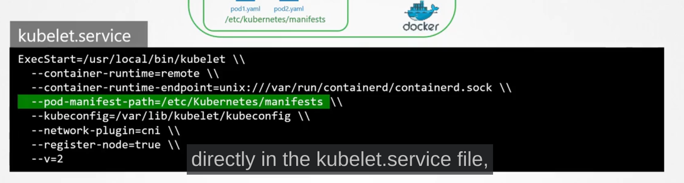

# Notes from udemy CKA preparation course.

## Core Concepts

### Cluster Architecture

Host application as containers 
worker nodes are the ships that load container.
control ship = master node
All stored in ETCD Cluster.
information about the containers in ETCD. in key:value format.

crain which is used to load the ships are kube-scheduler. it is used for where it be placed.

Controllers
1. Node-controllers
2. Replication-controller
3. Controller-Manager


Kube-apiserver = the primary management controller k8s. It is responsible for orchestrating different things in kube-apiserver.

Docker is the container runtime engine. also support rkt and contneird

Kubelet = captain of each ship(node) manage container running in the 

kube-proxy =  it wil ensure all the rules are in place and running.

### Docker vs Container-d

k8s is build to orchestate docker at first.
k8s introduced is CRI(continaer runtime interface) to work with it
If it adhere to OCI standards. Open Container Initiative. imagespec and runtimespec
dockershim is as temporary fix to work with docker since it's doest have OCI standards.

containerD also part of docker. if we don't docker. we car use crt
nerdctl docker-liek cli for containerD.

```bash
# docker command and it equivalent nerdctl command
docker 

nerdctl

docker run --name redis redis:alpine

nerdctl run --name redis redis:alpine

docker run --name webserver -p 80:80 -d nginx

nerdctl run --name webserver -p 80:80 -d nginx
```

crictl provide a CLI for CRI compatible container. it's only used for debugging purposes

```bash
crictl

crictl pull busybox

crictl images

crictl ps -a

crictl exec -i -t <container-id> ls

crictl logs <container-id> # to see logs 

crictl pods
```

### ETCD

key-value store

etcd is a distrbuted reliable key-value store that is simple, secure & fast.

when you install and run etcd it will start in port 2379. `./etcd`
we can store key-value as 
```bash
# it will create a key value pair
./etcdctl set key1 value1
./etcdctl put key1 value1 #v3

# to get value
./etcdctl get key1 #v2 and v3


# to check which api version is set to work with v2 or v3. default version in 3

./etcdctl --version

# to list all the commands
./etcdctl

# to set version
ETCDCTL_API=3 ./etcdctl version

# or set for entire session
export ETCDCTL_API=3 ./etcdctl version


```

### ETCD in Kubernetes
 
stores all the changes. etcd is also deployed according to our setup

### ETCD commands


ETCDCTL is the CLI tool used to interact with ETCD.

ETCDCTL can interact with ETCD Server using 2 API versions - Version 2 and Version 3.  By default its set to use Version 2. Each version has different sets of commands.

For example ETCDCTL version 2 supports the following commands:

```bash
etcdctl backup
etcdctl cluster-health
etcdctl mk
etcdctl mkdir
etcdctl set

```


Whereas the commands are different in version 3

```bash
etcdctl snapshot save 
etcdctl endpoint health
etcdctl get
etcdctl put
```


To set the right version of API set the environment variable ETCDCTL_API command

export ETCDCTL_API=3


When API version is not set, it is assumed to be set to version 2. And version 3 commands listed above don't work. When API version is set to version 3, version 2 commands listed above don't work.


Apart from that, you must also specify path to certificate files so that ETCDCTL can authenticate to the ETCD API Server. The certificate files are available in the etcd-master at the following path. We discuss more about certificates in the security section of this course. So don't worry if this looks complex:

```bash
--cacert /etc/kubernetes/pki/etcd/ca.crt     
--cert /etc/kubernetes/pki/etcd/server.crt     
--key /etc/kubernetes/pki/etcd/server.key
```

So for the commands I showed in the previous video to work you must specify the ETCDCTL API version and path to certificate files. Below is the final form:

```bash
kubectl exec etcd-master -n kube-system -- sh -c "ETCDCTL_API=3 etcdctl get / --prefix --keys-only --limit=10 --cacert /etc/kubernetes/pki/etcd/ca.crt --cert /etc/kubernetes/pki/etcd/server.crt  --key /etc/kubernetes/pki/etcd/server.key"
```

### kube-apiserver

primary management controller.

when we run a command like `create pod`
1. Authenticate user
2. Validate Request
3. Retrieve data from etcd
4. Update ETCD
5. Scheduler it finds te best node to pod
6. kubelet in that specified node create the pod and update it in etcd

everything goes to kube-apiserver

### kube controller manager.

1. watch status 
2. Remediate situation


Node-controller check the status of nodes and if a node unreaacble it will destroyed and created more

replication controller. check status and create again
### kube Scheduler

decide which pod goes to which node.
right container ends up right node.
it depends on resource requirements. It first filter nodes, the rand nodes

### Kubelet

likes the captain of the ship
it will place the container in a pod. 

### kube proxy

Pod network is internal network in k8s. 
it runs is each pod. it will look for services. when a service is created it will create rules to connect to it.

### Pods

Pod is single instance of application. 
it will increase a pod in each node.

Multi container pods is only for helper containers. can't have same type of pod.

how to deploy pod ``` kubectl run nginx ```

### Pods with yaml

All k8s defintion contains four things
1. apiVersion: version we are going to create
2. kind: type or resources we are going to create
3. metadata: data about object like name, labels
4. spec: It's a dictionary

``` bash
kubectl create -f pod-definition.yaml

kubectl get pods # to see the pods

kubectl describe pod <pod name> #check the event session to know what's the error

# to check no of pods
kubectl get pods

# to check the help
kubectl run --help

# to create a pod easiest way
kubectl run nginx --image=nginx

# to help with deployment
kubectl run redis --image=redis123 --dry-run=client -o yaml
#it will output the defintion in yaml format. we can copy paste it.

kubectl run redis --image=redis123 --dry-run=client -o yaml > redis.yaml
# To store it in a yaml file

kubectl edit pod <podname> # to edit the pod

# or edit the yaml file
kubectl apply -f redis.yaml to apply the changes

```

pod.yaml file
```bash
apiVersion: v1
kind: Pod
metadata:
  name: nginx
  labels:
    app: nginx
    tier: frontend
spec:
  containers:
  - name: nginx
    image: nginx
  - name: busybox  #if you want more than one container
    image: busybox  
```

### replica-set

replication controller(old) replicset(new) helps to run multiple instance of container in our node.
it will 

rc-definition.yml
```bash
apiVersion: v1
kind: ReplicationController
metadata: #meta data of replicaset
  name: myapp-rc
  labels:
    app: myapp
    type: frontend
spec:
  template: #to have a template of pod we are creating. the metadata and spec are copied from pod
    metadata: #metadata of pod
      name: nginx
      labels:
        app: nginx
        tier: frontend
    spec:
      containers:
      - name: nginx
        image: nginx
  replicas: 3 #how much replicas are needed   
```

```bash
# find replication controller.
kubectl create -f rc-defintion.yml
# to see different replicas
kubctl get replicationcontroller

kubectl get replicaset #to get replicasets

kubectl get pods

kubectl describe replicaset new-replica-set #to see the details fo replicaset

kubectl describe pod <pod-name> #to see issues in more detail

kubectl delete pod <pod-name> #to delete pods

kubectl explain replicaset #to see the explnation of replicaset
```

##### replicaset


replicaset-defintion.yml
```bash
apiVersion: apps/v1
kind: ReplicaSet
metadata: #meta data of replicaset
  name: myapp-replicaset
  labels:
    app: myapp
    type: front-end
spec:
  template: #to have a template of pod we are creating. the metadata and spec are copied from pod
    metadata: #metadata of pod
      name: myapp-pod
      labels:
        app: myapp
        tier: front-end
    spec:
      containers:
      - name: nginx-container
        image: nginx
  replicas: 3 #how much replicas are needed 
  selector: #Major difference between replicaset and replication controller.
    matchLabels:
      type: front-end  

```

Replicaset monitor and deploy if their is any failure. 
this lables will help to monitor everthing and create new one if their is anyfailure.

to scale the replicaset. update the number in replicas `replicas: 6`
then run ``` kubectl replace -f replicaset-defintion.yml```

```bash
kubectl create -f replicaset-defintion.yml
kubectl get replicaset
kubectl delete replicaset <name of replicaset>
kubectl replace -f replicaset-definition.yml #to replace the replicaset
kubectl scale --replicas=6 -f replicaset-defintion.yml #using definition file

kubectl scale --replicas=6 replicaset myapp-replicaset # using type and name

kubectl edit rs new-replica-set  #to edit the rs
#after the above step delete all the pods in replica set so that it can replaced by new ones

controlplane ~ ➜  kubectl delete pod new-replica-set-2zbf5 new-replica-set-bglld new-replica-set-g2zwh new-replica-set-8swq9 
pod "new-replica-set-2zbf5" deleted
pod "new-replica-set-bglld" deleted
pod "new-replica-set-g2zwh" deleted
pod "new-replica-set-8swq9" deleted

controlplane ~ ➜  kubectl get pods
NAME                    READY   STATUS    RESTARTS   AGE
new-replica-set-9z2wp   1/1     Running   0          7s
new-replica-set-ppv47   1/1     Running   0          7s
new-replica-set-l5vsg   1/1     Running   0          7s
new-replica-set-nhpkp   1/1     Running   0          7s


#to scale or edit replica set

controlplane ~ ➜  kubectl edit rs new-replica-set 
replicaset.apps/new-replica-set edited

controlplane ~ ➜  kubectl get pods
NAME                    READY   STATUS    RESTARTS   AGE
new-replica-set-9z2wp   1/1     Running   0          2m30s
new-replica-set-ppv47   1/1     Running   0          2m30s
new-replica-set-l5vsg   1/1     Running   0          2m30s
new-replica-set-nhpkp   1/1     Running   0          2m30s
new-replica-set-jc78h   1/1     Running   0          13s

#to scale to 2 replicas
controlplane ~ ➜  kubectl scale --replicas=2 rs/new-replica-set 
replicaset.apps/new-replica-set scaled

controlplane ~ ➜  kubectl get pods
NAME                    READY   STATUS        RESTARTS   AGE
new-replica-set-9z2wp   1/1     Running       0          3m18s
new-replica-set-l5vsg   1/1     Running       0          3m18s
new-replica-set-ppv47   1/1     Terminating   0          3m18s
new-replica-set-jc78h   1/1     Terminating   0          61s
new-replica-set-nhpkp   1/1     Terminating   0          3m18s

# the above command changes the size of replicasets. but the number will stay the same in file
```

### Deployments

It is have bigger scope than replica-set. it will update if there is any updates in the replicaset.

```bash
apiVersion: apps/v1
kind: Deployment
metadata: #meta data of replicaset
  name: myapp-replicaset
  labels:
    app: myapp
    type: front-end
spec:
  template: #to have a template of pod we are creating. the metadata and spec are copied from pod
    metadata: #metadata of pod
      name: myapp-pod
      labels:
        app: myapp
        tier: front-end
    spec:
      containers:
      - name: nginx-container
        image: nginx
  replicas: 3 #how much replicas are needed 
  selector: #Major difference between replicaset and replication controller.
    matchLabels:
      type: front-end  

```

deployment create replicaset and thus pods

```bash
kubectl get all #see all the resources created

kubectl get deployments

#Create an NGINX Pod

kubectl run nginx --image=nginx

#Generate POD Manifest YAML file (-o yaml). Don't create it(--dry-run)

kubectl run nginx --image=nginx --dry-run=client -o yaml

# Create a deployment

kubectl create deployment --image=nginx nginx

# Generate Deployment YAML file (-o yaml). Don't create it(--dry-run)

kubectl create deployment --image=nginx nginx --dry-run=client -o yaml

#Generate Deployment YAML file (-o yaml). Don’t create it(–dry-run) and save it to a file.

kubectl create deployment --image=nginx nginx --dry-run=client -o yaml > nginx-deployment.yaml

#Make necessary changes to the file (for example, adding more replicas) and then create the deployment.

kubectl create -f nginx-deployment.yaml


#OR

#In k8s version 1.19+, we can specify the --replicas option to create a deployment with 4 replicas.

kubectl create deployment --image=nginx nginx --replicas=4 --dry-run=client -o yaml > nginx-deployment.yaml

kubectl create deployment --help #to see the imperative commands and it's help
```

### Services

Connectivity betwen different users, database, frontend. losecoupling between different service.

In Kubernetes, a Service is a method for exposing a network application that is running as one or more Pods in your cluster.

A key aim of Services in Kubernetes is that you don't need to modify your existing application to use an unfamiliar service discovery mechanism. You can run code in Pods, whether this is a code designed for a cloud-native world, or an older app you've containerized. You use a Service to make that set of Pods available on the network so that clients can interact with it.

Each Pod gets its own IP address (Kubernetes expects network plugins to ensure this). For a given Deployment in your cluster, the set of Pods running in one moment in time could be different from the set of Pods running that application a moment later.

This leads to a problem: if some set of Pods (call them "backends") provides functionality to other Pods (call them "frontends") inside your cluster, how do the frontends find out and keep track of which IP address to connect to, so that the frontend can use the backend part of the workload?

listen to port on pod and forward that traffic into a port in the node.


service types.

**ClusterIP**
Exposes the Service on a cluster-internal IP. Choosing this value makes the Service only reachable from within the cluster. This is the default that is used if you don't explicitly specify a type for a Service. You can expose the Service to the public internet using an Ingress or a Gateway.
**NodePort**
Exposes the Service on each Node's IP at a static port (the NodePort). To make the node port available, Kubernetes sets up a cluster IP address, the same as if you had requested a Service of type: ClusterIP.
**LoadBalancer**
Exposes the Service externally using an external load balancer. Kubernetes does not directly offer a load balancing component; you must provide one, or you can integrate your Kubernetes cluster with a cloud provider.
**ExternalName**
Maps the Service to the contents of the externalName field (for example, to the hostname api.foo.bar.example). The mapping configures your cluster's DNS server to return a CNAME record with that external hostname value. No proxying of any kind is set up.

port on pod: target port. 
port: the port in service
port on the node where the node is accessed externally : nodeport

service-definition.yaml
```bash
apiVersion: v1
kind: Service
metadata:
  name: myapp-service
spec:
  type: NodePort
  ports: #it's an arry and -targetPort indicate the first port in an array.
  - targetPort: 80
    port: 80
    nodePort: 30008
  selector:
    app: myapp
    type: front-end # labels from the pod defintion file
```

```bash


```

It will create a service spanning accross the nodes and make the service available

### ClusterIP

Ip of the clusterIP
service-definition.yaml
```bash
apiVersion: v1
kind: Service
metadata:
  name: backend
spec:
  type: clusterIP
  ports: #it's an arry and -targetPort indicate the first port in an array.
  - targetPort: 80
    port: 80
  selector:
    app: myapp
    type: back-end # labels from the pod defintion file
```

### Loadbalancer

If we are hosted our application in multiple nodes. the data is accessible to all the nodeIps.
Users need a single URL. 

```bash
apiVersion: v1
kind: Service
metadata:
  name: myapp-service
spec:
  type: LoadBalancer
  ports: #it's an arry and -targetPort indicate the first port in an array.
  - targetPort: 80
    port: 80
    nodePort: 30008
  selector:
    app: myapp
    type: front-end
```

### NameSpaces

it is used for isolation
kube-system, Default, kube-public the namespace created in k8s
We can define policies, quota of resources each of namespaces.

to connect to another service in another namespace.
```bash
db-service.dev.svc.cluster.local

kubectl get pods --namespace=kube-system #list resources of another namespace.

kubectl create -f pod-definition.yml --namespace=dev #to create pod in another namespace

```

Name space in pod-defintion.yml file
```bash
apiVersion: v1
kind: Pod

metadata:
  name: myapp-pod
  namespace: dev
  labels:
    app: myapp
    type: front-end
  spec:
    containers:
    - name: nginx-container
      image: nginx

```

creation of namespace using namespace-dev.yml file

```bash
apiVersion: v1
kind: Namespace
metadata:
  name: dev
```

```bash
kubectl create -f namespace-dev.yml

kubectl create namespace dev # for easy creation

kubectl config set-context $(kubectl config current-context) --namespace=dev # to set current context to dev

kubectl get pods

kubect get pods --namespace=default

kubectl get pods --namespace=prod

kubectl get pods --all-namespaces #to see pods in all namespaces

kubectl get ns
kubectl get namespaces #to get the namespaces

#to create in specific namespace
controlplane ~ ➜  kubectl run redis --image redis -n finance 
pod/redis created

controlplane ~ ➜  kubectl get pods -n finance 
NAME      READY   STATUS    RESTARTS   AGE
payroll   1/1     Running   0          10m
redis     1/1     Running   0          15s

#to get pods in all namespaces
kubectl get pods --all-namespaces 


#to see the services
kubectl get svc -n=dev
```

For defining **Resource Quota** for a namespace
compute-quota.yaml

```bash
apiVersion: v1
kind: ResourceQuota
metadata:
  name: compute-quota
  namespace: dev
spec:
  hard:
    pods: "10"
    requests.cpu: "4"
    requests.memory: 5Gi
    limits.cpu: "10"
    limits.memory: 10Gi
```

### Imperative and Declarative

Imperative: saying all the  steps to be done: running commands
Declarative: only giving the .yaml file to work

```bash
# Create Objects
kubectl run --image=nginx nginx
kubectl create deployment --image=nginx nginx
kubectl expose deployment nginx --port 80

#Update Objects
kubectl edit deployment nginx
kubectl scale deployment nginx --replicas=5
kubectl set image deployment nginx nginx=nginx:1.18

kubectl replace -f nginx.yaml  #after editing the .yaml file
kubectl replace --force -f nginx.yaml  #forcefully replacing it


#part two

kubectl run nginx-pod --image=nginx:alpine #pod with name nginx-pod and image nginx:alpine

kubectl run --help #help about run

#use kubectl expose command is most cases to expose a particular pod
#use kubectl create service command when you need to specify a node port

kubectl expose pod redis --port=6379 --name=redis-service #expose on port 6379 and redis-service name

kubectl create deployment webapp --image=kodekloud/webapp-color --replicas=3 #creating deployment

kubectl run custom-nginx --image nginx --port 8080 #to create a deployment and expose it to a container port

kubectl create deployment redis-deploy --image redis --replicas 2 --namespace dev-ns #in a specific namespace


kubectl run httpd --image httpd:alpine --port 80 --expose true #to create a clusterip
service/httpd created
pod/httpd created
```

--dry-run: By default as soon as the command is run, the resource will be created. If you simply want to test your command , use the --dry-run=client option. This will not create the resource, instead, tell you whether the resource can be created and if your command is right.

-o yaml: This will output the resource definition in YAML format on screen.


Use the above two in combination to generate a resource definition file quickly, that you can then modify and create resources as required, instead of creating the files from scratch.


POD
Create an NGINX Pod

kubectl run nginx --image=nginx


Generate POD Manifest YAML file (-o yaml). Don't create it(--dry-run)

kubectl run nginx --image=nginx --dry-run=client -o yaml


Deployment
Create a deployment

kubectl create deployment --image=nginx nginx


Generate Deployment YAML file (-o yaml). Don't create it(--dry-run)

kubectl create deployment --image=nginx nginx --dry-run=client -o yaml


Generate Deployment with 4 Replicas

kubectl create deployment nginx --image=nginx --replicas=4


You can also scale a deployment using the kubectl scale command.

kubectl scale deployment nginx --replicas=4

Another way to do this is to save the YAML definition to a file and modify

kubectl create deployment nginx --image=nginx --dry-run=client -o yaml > nginx-deployment.yaml


You can then update the YAML file with the replicas or any other field before creating the deployment.


Service
Create a Service named redis-service of type ClusterIP to expose pod redis on port 6379

kubectl expose pod redis --port=6379 --name redis-service --dry-run=client -o yaml

(This will automatically use the pod's labels as selectors)

Or

kubectl create service clusterip redis --tcp=6379:6379 --dry-run=client -o yaml (This will not use the pods labels as selectors, instead it will assume selectors as app=redis. You cannot pass in selectors as an option. So it does not work very well if your pod has a different label set. So generate the file and modify the selectors before creating the service)


Create a Service named nginx of type NodePort to expose pod nginx's port 80 on port 30080 on the nodes:

kubectl expose pod nginx --type=NodePort --port=80 --name=nginx-service --dry-run=client -o yaml

(This will automatically use the pod's labels as selectors, but you cannot specify the node port. You have to generate a definition file and then add the node port in manually before creating the service with the pod.)

Or

kubectl create service nodeport nginx --tcp=80:80 --node-port=30080 --dry-run=client -o yaml

(This will not use the pods labels as selectors)

Both the above commands have their own challenges. While one of it cannot accept a selector the other cannot accept a node port. I would recommend going with the kubectl expose command. If you need to specify a node port, generate a definition file using the same command and manually input the nodeport before creating the service.

https://kubernetes.io/docs/reference/generated/kubectl/kubectl-commands

https://kubernetes.io/docs/reference/kubectl/conventions/


Declartive

```bash

#create objects

kubectl apply -f nginx.yaml #it will check if the resource is there or not. if ther it skip otherwise create it

kubectl apply -f /path/to/config-files #create all the resources from config files

#Update Objects

kubectl apply -f nginx.yaml
```

user imperative command in exam and declarative in working

https://kubernetes.io/docs/reference/generated/kubectl/kubectl-commands
https://kubernetes.io/docs/reference/kubectl/conventions/

### Kubectl apply command

takes the local file. 
if configuration doesn't ther create live object configuration file
and saved json format(last applied configuration). so 3 things

live object configuration

## Scheduling

easiest wayt to schedule a node without schedular is set `nodeName: node02` filled.

pod-definition.yaml
```bash
apiVersion: v1
kind: Pod
metadata:
  name: nginx
  labels:
    name: nginx
spec:
  containers:
  - name: nginx
    image: nginx
    ports:
    - containerPort: 8080
    nodeName: node02
```

pod-bind-definiton.yaml
```bash
apiVersion: v1
kind: Binding
metadata:
  name: nginx
target:
  apiVersion: v1
  kind: Node
  name: node02
```


### Labels and Selectors

Labels give names to items like
class: bird, kind: Domestic, Color: Green

selector helps to filter these items
class = mammal
color = Green

```bash
apiVersion: v1
kind: Pod
metadata:
  name: simple-webapp
  labels:
    app: App1
    function: Front-end
spec:
  containers:
  - name: simple-webapp
    image: simple-webapp
    ports:
    - containerPort: 8080
```

Once the pod is created to select the pod created use
```bash
# to select certain type of app
kubectl get pods --selector app=App1
```

replicaset-definition.yaml
```bash
apiVersion: apps/v1
kind: ReplicaSet
metadata:
  name: simple-webapp
  labels: #labels of replicaset
    app: App1
    function: Front-end
  annotations: # used to store version number. phonenumber emails for integrations purposes.
    buildversion: 1.34
spec:
  replicas: 3
  selector: # used to select the pods
    matchLabels:
      app: App1
  template:
    metadata:
      labels: # labels of pod. selectors use this
        app: App1
        function: Front-end
    spec:
      containers:
      - name: simple-webapp
        image: simple-webapp

```

service-definition.yaml

```bash
apiVersion: v1
kind: Service
metadata:
  name: my-service
spec:
  selector: # select App1 in pods 
    app: App1
  ports:
  - protocol: TCP
    port: 80
    targetPort: 9376
```

```bash
kubectl get pods --selector env=dev #to see the pods in specific selector

kubectl get pods --selector env=dev | wc -l #to have a word count

kubectl get pods --selector env=dev --no-headers | wc -l #without headers

 kubectl get all --selector env=prod --no-headers | wc -l #all resources in env=production

kubectl get all --selector env=prod,bu=finance,tier=frontend #to select multiple labels
```

### Taints and Toleration

A node with tainted those pods have tolerations can place that in particular place.
**Taint effects**
1. NoSchedule
2. PreferNoSchedule
3. NoExecute

```bash
kubectl taint nodes <node-name> key=value:tain-effect

kubectl taint nodes node1 app=blue:NoSchedule #nothing will be scheduled
```

pod-defintion.yml
```bash
apiVersion: v1
kind: Pod
metadata:
  name: myapp-pod
spec:
  containers:
  - name: nginx-container
    image: nginx

  tolerations: # same as app=blue:NoSchedule we used in the taint command in ""
  - key:"app"
    operator:"Equal"
    value:"blue"
    effect:"NoSchedule"
```

```bash
 kubectl taint node node01 spray=mortein:NoSchedule
#tainting a node

kubectl run bee --image nginx --dry-run=client -o yaml > bee.yaml #creating file

kubectl get pods -o wide #to see more details


controlplane ~ ➜  kubectl taint node controlplane node-role.kubernetes.io/control-plane:NoSchedule-
node/controlplane untainted #copy the taint to remove it
```

https://kubernetes.io/docs/concepts/scheduling-eviction/taint-and-toleration/

tells the node which pod to be accepted

### Node Selectors

first we need to label nodes.
```
kubectl label nodes node-1 size=Large
```

pod-defintion.yml
```bash
apiVersion:
kind: Pod
metadata:
  name: myapp-pod
spec:
  containers:
  - name: data-processor
    image: data-processor

  nodeSelector:
    size: Large
```

When pod is created it placed in the node.

### node affinity

To ensure the particular pods placed in desired nodes.

pod-definition.yml
```bash
apiVersion:
kind:
metadata:
  name: myapp-pod
spec:

containers:
- name: data-processor
  image: data-processor
affinity:
  nodeAffinity:
    requiredDuringSchedulingIgnoredDuringExecution:
      nodeSelectorTerms:
      - matchExpressions:
        - key: size
          operator: Exists
```
node affinity rules
```bash
requiredDuringSchedulingIgnoredDuringExecution
preferredDuringSchedulingIgnoredDuringExecution

#planned
requiredDuringSchedulingrequiredDuringExecution
```

duringscheduling: it will check if node is there not during scheduling
duringexection: important if there a change of labels of nodes

pod-with-affinity-preferred-weight.yaml
```bash
apiVersion: v1
kind: Pod
metadata:
  name: with-affinity-preferred-weight
spec:
  affinity:
    nodeAffinity:
      requiredDuringSchedulingIgnoredDuringExecution:
        nodeSelectorTerms:
        - matchExpressions:
          - key: kubernetes.io/os
            operator: In
            values:
            - linux
      preferredDuringSchedulingIgnoredDuringExecution:
      - weight: 1
        preference:
          matchExpressions:
          - key: label-1
            operator: In
            values:
            - key-1
      - weight: 50
        preference:
          matchExpressions:
          - key: label-2
            operator: In
            values:
            - key-2
  containers:
  - name: with-node-affinity
    image: registry.k8s.io/pause:2.0
```


### Taints/Tolerations and Node Affinity.

Taints and Tolerations helps to which pod should not be placed. But the pod required can be placed in other nodes.

NodeAffinity helps to which pod should be placed. but other pods can be placed in a particular node.

We need to use both of them to get a desired results.

### Resource Requirments and Limits

pod-definition.yaml
```bash
apiVersion: v1
kind: Pod
metadata:
  name: simple-webapp-color
  labels:
    name: simple-webapp-color
spec:
  containers:
  - name: simple-webapp-color
    image: simple-webapp-color
    ports:
    - containerPort: 8080
    resources:
      requests: #the minimum requirment
        memory: "1Gi"
        cpu: 1
      limits: # the maximum requirment
        memory: "2Gi"
        cpu: 2
```

Requesting a certain amount of memory and cpu. 
Cpu can't go beyond limit. But memory can go beyond the limit. but it go beyond the memory. but if the pod cis consuming the memory more than it's limits it is terminated with OOM(Out Of Memory).

best practice is having requests but not limits. since a resource can use the resource if no one is using. but the same time can return the extra resources when other pods which have request set is needed.

limit-range-cpu.yaml 
```bash
apiVersion: v1
kind: LimitRange
metadata:
  name: cpu-resource-constraint
spec:
  limits:
  - default: #limit
      cpu: 500m
    defaultRequest: #request
      cpu: 500m
    max: #limit
      cpu: "1"
    min: #request
      cpu: 100m
    type: Container
```
default for all the containers and pods created in namespace without having a set of values set.

limit-range-memory.yaml
```bash
apiVersion: v1
kind: LimitRange
metadata:
  name: memory-resource-constraint
spec:
  limits:
  - default:
      memory: 1Gi
    defaultRequest:
      memory: 1Gi
    max:
      memory: 1Gi
    min:
      memory: 500mi
    type: Container
```

Resource quota at namespace level. for pods without limits and requests.

```bash
apiVersion: v1
kind: ResourceQuota
metadata:
  name: my-resource-quota
spec:
  hard:
    requests.cpu: 4
    requests.memory: 4Gi
    limits.cpu: 10
    limits.memory: 10Gi
```

```bash
kubectl replace --force -f <file0name>
```

### Daemon Sets

Automatically added or destroyed in the pod. Daemon set is added.

If you want to add a monitoring solution, Logs Viewer or any pods like that daemon set is the perfect companion for that. No need worry about adding or removing agents from the pod because daemon set will take care of that.

A DaemonSet ensures that all (or some) Nodes run a copy of a Pod. As nodes are added to the cluster, Pods are added to them. As nodes are removed from the cluster, those Pods are garbage collected. Deleting a DaemonSet will clean up the Pods it created.

Some typical uses of a DaemonSet are:

running a cluster storage daemon on every node
running a logs collection daemon on every node
running a node monitoring daemon on every node
In a simple case, one DaemonSet, covering all nodes, would be used for each type of daemon. A more complex setup might use multiple DaemonSets for a single type of daemon, but with different flags and/or different memory and cpu requests for different hardware types.


replicaset-definition.yaml
```bash
apiVersion: apps/v1
kind: ReplicaSet
metadata:
  name: monitoring-daemon
spec:
  selector:
    matchLabels:
      app: monitoring-agent
  template:
    metadata:
      labels:
        app: monitoring-agent
    spec:
      containers:
      - name: monitoring-agent
        name: monitoring-agent
```

daemon-set-definiton.yaml this is similar to replicaset-definition.yaml file but diff in kind
```bash
apiVersion: apps/v1
kind: DaemonSet
metadata:
  name: monitoring-daemon
spec:
  selector:
    matchLabels:
      app: monitoring-agent
  template:
    metadata:
      labels:
        app: monitoring-agent
    spec:
      containers:
      - name: monitoring-agent
        name: monitoring-agent
```

```
kubectl get daemonsets
kubectl describe daemonsets monitoring-daemon
```

```bash
apiVersion: apps/v1
kind: DaemonSet
metadata:
  name: fluentd-elasticsearch
  namespace: kube-system
  labels:
    k8s-app: fluentd-logging
spec:
  selector:
    matchLabels:
      name: fluentd-elasticsearch
  template:
    metadata:
      labels:
        name: fluentd-elasticsearch
    spec:
      tolerations:
      # these tolerations are to have the daemonset runnable on control plane nodes
      # remove them if your control plane nodes should not run pods
      - key: node-role.kubernetes.io/control-plane
        operator: Exists
        effect: NoSchedule
      - key: node-role.kubernetes.io/master
        operator: Exists
        effect: NoSchedule
      containers:
      - name: fluentd-elasticsearch
        image: quay.io/fluentd_elasticsearch/fluentd:v2.5.2
        resources:
          limits:
            memory: 200Mi
          requests:
            cpu: 100m
            memory: 200Mi
        volumeMounts:
        - name: varlog
          mountPath: /var/log
      # it may be desirable to set a high priority class to ensure that a DaemonSet Pod
      # preempts running Pods
      # priorityClassName: important
      terminationGracePeriodSeconds: 30
      volumes:
      - name: varlog
        hostPath:
          path: /var/log
```


### Static Pods

kubelet wait for kube-apiserver to give instruction to create cluster. What if there is no kube-apiserver or master.
kubelet can manage nodes independly.
kubelet can create their on pods(pods only no replicasets/daemonsets). We can configure a kubelet to read from a directory called /etc/kubernetes/manifests. Where there is stored all the pod definition files as pod1.yaml/pod2.yaml.



kubelet works on pod level can only understands pods. 

since static pods are depended on control plane. we can add control plane etcd and everything

`kubectl get pods -n kube-system`

static pods deploy **control plane** components as static pods
daemonset deply monitoring agents, Logging agents on node

both are ignored by the Kube-schedular

```bash
#where the kubelet configuration resides
cat /var/lib/kubelet/config.yaml

kubectl run static-busybox --image busybox --dry-run=client -o yaml --command -- sleep 1000 > /etc/kubernetes/manifests/static-busybox.yaml 

kubectl get nodes -o wide #to find the ip address of the node
```

simply edit the file and save it will refelct the changes

### Multiple Schedular

we can create other schedular so some of them can be used as main schedular or schedular for specific pods.

my-scheduler-2-config.yaml
```bash
apiVersion: kubescheduler.config.k8s.io/v1
kind: KubeSchedulerConfiguration
profiles:
- schedulerName: my-scheduler-2
leaderElection:
  leaderElect: true
  resourceNamespace: kube-system
  resourceName: lock-object-my-scheduler
```

we can create scheduler by downloading the binary and starting different schedulers as service.

```
# ExecStart have the location of kube-scheduler
ExecStart=/usr/local/bin/kube-scheduler \\ --config=/etc/kubernetes/config/my-scheduler-2.yaml

#config as location of custom kube-scheduler name
```

deploying scheduler as pod
my-custom-scheduler.yaml
```bash
apiVersion: v1
kind: Pod
metadata:
  name: my-custom-scheduler
  namespace: kube-system
spec:
  containers:
  - command:
    - kube-scheduler
    - --address=127.0.0.1
    - --kubeconfig=/etc/kubernetes/scheduler.conf
    - --config=/etc/kubernetes/my-scheduler-config.yaml

    image: k8s.gcr.io/kube-scheduler-amd64:v1.11.3
    name: kube-scheduler
  ```

** Using custom scheduler

pod-definition.yaml
```bash
apiVersion: v1
kind: Pod
metadata:
  name: nginx
spec:
  containers:
  - image: nginx
    name: nginx
  
  schedulerName: my-custom-scheduler #scheduler name
```

### Scheduler Profiles

When pod si created it will be in Scheduling Queue. and pod with higher prioriy. Then filtering face what can be placed or not. Then Scoring phase every node is scored according to it, which node have more space left. Then Pod is Binded with the Node.

Scheduling Queue: PrioritySort
Filtering: NodeResourcesFit, NodeName, NodeUnschedulable
Scoring: NodeResourcesFit, ImageLocality
Binding: DefaultBinder

All the plugins are added to extenstions

https://github.com/kubernetes/community/blob/master/contributors/devel/sig-scheduling/scheduling_code_hierarchy_overview.md

https://kubernetes.io/blog/2017/03/advanced-scheduling-in-kubernetes/

https://jvns.ca/blog/2017/07/27/how-does-the-kubernetes-scheduler-work/

https://stackoverflow.com/questions/28857993/how-does-kubernetes-scheduler-work


### Monitor k8s cluster

Install metric server from github or using minikube.

### Managing Application Logs.

If we are creating two containers using a single yaml file.

```bash
apiVersion: v1
kind: Pod
metadata:
  name: event-simulator-pod
spec:
  containers:
  - name: event-simulator
    image: kodekloud/event-simulator
  - name: image-processor
    image: some-image-processor
```

To see logs of kubectl use.
```bash
kubectl logs -f event-simulator-pod event-simulator

kubectl logs <podname>
```

## Application Lifecycle Management

### Rolling Updates and Rollbacks

Every time container got changes a new rollout happeing

```bash
# to see the status of a deployment
kubectl rollout status deployment/myapp-deployment

# To see the history of the rollouts
kubectl rollout history deployment/myapp-deployment

#To update the image of the application to version 2, use the set image subcommand, followed by the deployment name and the new image version:

kubectl set image deployments/kubernetes-bootcamp kubernetes-bootcamp=docker.io/jocatalin/kubernetes-bootcamp:v2

kubectl apply -f deployment-definition.yml
# to make changes in deployment

kubectl rollout undo deployment/myapp-deployment
# to rollout(going back) to the last change 
```

**Deployment Strategy**

Recreate: destroy all the pods at once and create everything it will have app down
Rolling update: destroy and update pods one-by-one. zero downtime.

```bash
#create a new pod
kubectl create -f deployment-definition.yml

#getting new update
kubectl get deployments

#updating the pods/deployment
kubectl set image deployment/myapp-deployment nginx=nginx:1.9.1 #it won't update the file only the deployment

kubectl apply -f deployment-definintion.yml #after updating the .yml file

#Status
kubectl rollout status deployment/myapp-deployment

kubectl rollout history deployment/myapp-deployment

#rollback to before state
kubectl rollout undo deployment/myapp-dep1


```

Their will be already a replicaset is present. and another replicaset is created. Every pod is created one by one then each pod is deleted one by one. Until all the pods are duplicated.


### command 

```bash
apiVersion: v1
kind: Pod
metadata:
  name: command-demo
  labels:
    purpose: demonstrate-command
spec:
  containers:
  - name: command-demo-container
    image: debian
    command: ["printenv"] # way 1
    command: ["sleep","5000"] # 3ways to define a command
    command: #way 2
    - "sleep"
    - "5000"

    command: ["sleep"]
    args: ["5000"]
    args: ["HOSTNAME", "KUBERNETES_PORT"]
  restartPolicy: OnFailure
```

### ENV Variables in K8s

Direct way of specifying variables

pod-definition.yaml
```bash
apiVersion: v1
kind: Pod
metadata:
  name: simple-webapp-color
spec:
  containers:
  - name: simple-webapp-color
    image: simple-webapp-color
    ports:
    - containerPort: 8080
    env:
    - name: APP_COLOR
      value: pink
```

Using ConfigMap
```bash
env:
- name: APP_COLOR
  valueFrom:
    configMapKeyRef:
```

Using Secrets
```bash
env:
- name: APP_COLOR
  valueFrom:
    secretKeyRef:
```

### ConfigMaps

Where varaibles are stored as keyvalue pairs. When application is created these values are injected as keyvalue pairs into the pod-definition file.

Create configmaps --->>> Inject them into 

```bash

#impertive way
kubectl create configmap \
  app-config --from-literal=APP_COLOR=blue \
             --from-literal=APP_MOD=prod

# using configmaps stored in a file
kubectl create configmap \
  app-config --from-file=app_config.properties
```

```
kubectl create -f config-map.yaml

kubectl get configmaps
```
config-map.yaml
```bash
apiVersion: v1
kind: ConfigMap
metadata:
  name: app-config
data:
  APP_COLOR: blue
  APP_MODE: prod
```

Injecting config maps to pods

pod-definition.yaml
```bash
apiVersion: v1
kind: Pod
metadata:
  name: simple-webapp-color
  labels:
    name: simple-webapp-color
spec:
  containers:
  - name: simple-webapp-color
    image: simple-webapp-color
    ports:
    - containerPort: 8080
    envFrom: #injecting env variables
    - configMapRef:
        name: app-config
```

### Secrets in Application

used to save secrets in a encoded format inside the pod. 

```bash
#imperative method

kubectl create secret generic <secret-name> --from-literal=<key>=<value>

kubectl create secret generic \
  app-secret --from-literal=DB_Host=mysql \
             --from-literal=DB_User=root


kubectl create secret generic \
    <secret-name> --from-file=<path-to-file>

kubectl create secret generic \
    app-secret --from-file=app_secret.properties

```


https://kubernetes.io/docs/tasks/inject-data-application/distribute-credentials-secure/#define-container-environment-variables-using-secret-data


declarative approach
secret-data.yaml
```bash
apiVersion: v1
kind: Secret
metadata:
  name: app-secret
data:
  DB_Host: <encoded format>
  DB_User: <encoded format>
  DB_Password: <encoded format>
```

```
kubectl create -f secret-data.yaml

kubectl get secrets

kubectl describe secrets
```

How to convert data into encoded format.

```
# IN linux
# to encode the value
echo -n '<text needed to be encoded> | base 64


# to decode the value
echo -n '<encoded text>' | base64 --decode

```

**Inject into pod**

```bash
apiVersion: v1
kind: Pod
metadata:
  name: simple-webapp-color
  labels:
    name: simple-webapp-color
spec:
  containers:
  - name: simple-webapp-color
    image: simple-webapp-color
    ports:
    - containerPort: 8080
    envFrom:
    - secretRef:
        name: app-secret
```

### Encrypting Secret Data at Rest 

Don't push secrets into github or anything. Since it's only encoded not encrypted.

### Multi Container Pods

LOG Agent and WEB Server

some containers needs to work together in pod. So we will give containers that can start together and destroyed together.

pod-definition.yaml
```bash
apiVersion: v1
kind: Pod
metadata:
  name: simple-webapp
  labels:
    name: simple-webapp
spec:
  containers:
  - name: simple-webapp
    image: simple-webapp
    ports:
    - containerPort: 8080
  - name: log-agent
    image: log-agent
```

### Init Containers

In a multi-container pod, each container is expected to run a process that stays alive as long as the POD's lifecycle. 
For example in the multi-container pod that we talked about earlier that has a web application and logging agent, both the containers are expected to stay alive at all times.

But their is times when you need to pulls a code or binary from a repository that will be used by the main web application. that is a task that will be run only on time when the pod is first created. This containers are called **initContainers**.

An initContainer is configured in a pod like all other containers, except that it is specified inside a initContainers section,  like this:

```bash
apiVersion: v1
kind: Pod
metadata:
  name: myapp-pod
  labels:
    app: myapp
spec:
  containers:
  - name: myapp-container
    image: busybox:1.28
    command: ['sh', '-c', 'echo The app is running! && sleep 3600']
  initContainers:
  - name: init-myservice
    image: busybox
    command: ['sh', '-c', 'git clone <some-repository-that-will-be-used-by-application> ; done;']
```
If any of the initContainers fail to complete, Kubernetes restarts the Pod repeatedly until the Init Container succeeds.

https://kubernetes.io/docs/concepts/workloads/pods/init-containers/

```bash
kubectl describe pods #to see pods
```


## Cluster Maintenance

### OS upgrade

If you want to remove pods and add new pods.

```
kubectl drain node-1  #it will mark the node unschedulable, then schedule all the pod in that node to another node. We can update os or other things in the nodes


kubectl cordon node-2 #mark node unschedulable. It won't delete existing pod. but new pods are not schedulable


kubectl uncordon node-1  #mark node schedulabe
```

### Cluster Upgrade process

K8s support recent 3 updates fro it's components. Like kubeapiserver, kubelet.
they will suppot only recent 3 updates. Like 1.10, 1.11. 1.12 extra.
To upgrade nodes first pass the pods to another nodes then upgrade the node or create an upgraded node then pass the pods.

Updating nodes simultaneously make issues like downtime extra. But updating one by one doesn't cause that issue.

We can only go one minor version at a time.

guess our current version is 1.11
```bash
apt-get upgrade -y kubeadm=1.12.0-00 #get kubeadm

#upgrade kubeadm

kubeadm upgrade apply v1.12.0

# upgrade kubelet

apt-get upgrade -y kubelet=1.12.0-00

systemctl restart kubelet

kubectl get nodes

kubeadm upgrade plan

cat /etc/*release* #says the current version
```

Steps to upgrade a node
```bash

# first drain the node and make unschedulabel. node name is node-1
kubectl drain node-1

# upgrade the kubeadm 
apt-get upgrade -y kubeadm=1.12.0-00 #version to which you want to upgrade

#upgrade kubelet
apt-get upgrade -y kubelet=1.12.0-00

#kubeadm upgrade
kubeadm upgrade node config --kubelet-version v1.12.0

# restart kubelet
systemctl restart kubelet

# To make it schedulabel
kubectl uncordon node-1

# do this to all the nodes node-1, node-2, node-3
```


``` kubeadm upgrade plan ``` we need upgrade kubeadm to upgrade the cluster

cluster upgrade.
``` cat /etc/*release*```

kubernetes.io/docs/tasks/administer-cluster/kubeadm/kubeadm-upgrade/

### Backup and Restore Methods


```bash
# query kubeapiserver and save the resource in 
# backup using kube apiserver
kubectl get all --all-namespaces -o yaml > all-deploy-services.yaml

# we can also backup using etcd
#ETCD cluster backupt. It is hosted in etcd cluster
# It will backup the snapshot
ETCDCTL_API=3 etcdctl \
    snapshot save snapshot.db

service kube-apiserver stop 

# saves the snapshot and save it in data dir 
ETCDCTL_API=3 etcdctl \
    snapshot save snapshot.db \
    --data-dir /var/lib/etcd-from-backup

# after that make changes to etcd configuration file etcd.service

# then reload the service daemon and restart the etcd cluster
systemctl daemon-reload
service etcd restart
service kube-apiserver start


ETCDCTL_API=3 etcdctl \
    snapshot save snapshot.db \

https://kubernetes.io/docs/tasks/administer-cluster/configure-upgrade-etcd/#backing-up-an-etcd-cluster

https://github.com/etcd-io/website/blob/main/content/en/docs/v3.5/op-guide/recovery.md

https://www.youtube.com/watch?v=qRPNuT080Hk

```


## Security

### Security Primitives in k8s

**Secure Hosts**

- password based authentication disabled
- SSH key based authentication

### Authentication


k8's doesn't store details internally it relay upon outside users and outside certificaition teams.

```bash
# we cannot create users or see users list like this
kubectl create user user1

kubectl list users

## but we can create and manage service accounts.
# Since the passwords and all managed by third party like LDAP

kubectl create serviceaccount sa1 #to create service accounts
```

all the request from admin or developers goes throught kube-apiserver and it's Authenticate User before processing the request.

kube-apiserver have static password file, static token file, certificates, identity services.


**Auth Mechnisms-Basic**

Create csv file with password, user and user-id
user-details.csv
```bash
password1,user1,user-id1
password2,user2,user-id2
password3,user3,user-id3
```
add this to kube-apiserver.service file
```bash
--basic-auth-file=user-details.csv
```
we can also have user-token-details.csv instead of that so that we can have tokenized password file.

### TLS certificates.

Securing k8s with TLS certificates and other cluster components.

### TLS Basics

certificate is used to have trust between two parties in a network.

symmetric encryption where we use the same key to encrypt and decrypt but the hacker can snipe into it and read the password.

Asymmetric Encryption. where uses two keys public and private.

If you want to have communication with a bank server. the bank send a public key with validation certificates from a authenticated certificate authority(CA). after that user uses this key to encrypt there symmetric key and send it to the bank. so that they can decrypt the password of the and other details of the users.

This symmetric is used for communication going forward.

Root Certificaties : used by CA
Server Certificates: Used by server
Client Certificates: in the Client

### TLS in k8s

The interactions between master and all the nodes need to be secured.

server components

kube-api server has apiserver.crt and apiserver.key / apiserver-kubelet-client.crt apiserver-kubelet-client.key
etcd server: etcdserver.crt etcdserver.key / apiserver-etcd-client.crt apiserver-etcd-client.key
kubelet server : kubelet.crt kubelet.key / kubelet-client.crt kubelet-client.key

client certificates for clients. 
admin admin.crt, admin.key
kubescheduler scheduler.crt scheduler.key
kube-controller-manger controller-manager.crt controler-manager.key
kube-proxy kube-proxy.crt kube-proxy.key

these 3 has key and crts

### viewing tls certificates

```bash
cat /etc/systemd/system/kube-apiserver.service
cat /etc/kubernetes/manifests/kube-apiserver.yaml
```

for viewing the certificate location after getting the certificate go to 
`/etc/kubernetes/pki/apiserver.crt`

```bash
openssl x509 -in /etc/kubernetes/pki/apiserver.crt -text -noout
```

### Certificate API

the key-cert pair that stored in server in cs server. 

1. Create Certificate Sigining Request Object.
``` openssl genrsa -out jane.key 2048 ```
2. Review Requests
``` openssl req -new -key jane.key -subj "/CN=jane" -out jane.csr ```

administor takes the key and makes a certificate sigining requests objects
this object is created by using a manifest file using usual fields.
jane.csr -> `cat jane.csr | base64` -> encoded format
jane-csr.yaml
```bash
apiVersion: certificates.k8s.io/v1
kind: CertificateSigningRequest
metadata:
  name: jane
spec:
  expirationSeconds: 600 #seconds
  usages:
  - digital signature
  - key encipherment
  - server auth
  request:
    <encoded text. then submit the request>
```
once the object is created all the request can be seen by admins by running.
`kubectl get csr`
3. Approve Requests
``` kubectl certificate approve <name of certificate(here jane)> ```
k8s signs the certificate using ca pairs and create a certificates for users.

4. Share Certs to Users.


``` 
# view the certificate using 
kubectl get csr jane -o yaml

# to decode the certificate 
echo "encoded text" | base64 --decode

# controller manager as
CSR-APPROVING CSR-SIGNING

cat /etc/kubernetes/manifests/kube-controller-manager.yaml
```

### KubeConfig

client uses certificates to query list pods using curl

```bash
kubectl get pods
  --server my-kube-playground:6443
  --client-key admin.key
  --client-certificate admin.crt
  --certificate-authority ca.crt
```

typing this is tedious task so we can mobe this to a file.
KubeConfig File
config
```bash
  --server my-kube-playground:6443
  --client-key admin.key
  --client-certificate admin.crt
  --certificate-authority ca.crt
```
use the below command after that
```bash
kubectl get pods
  --kubeconfig config(name of the file)
```

usually it will look for file in `&HOME/.kube/config` where you don't need to specify the path.

kubeconfig file is in specific formats
clusters: to which you can access
Users: who as access to this cluster
Context: which user account can acces which cluster


#in below file the details are hidden
```bash
apiVersion: v1
kind: Config
current-context: dev-user@google
clusters:
- name: my-kube-playground
- name: productions
- name: google
contexts:
- name: my-kube-admin@my-kube-playground
- name: dev-user@google
- name: prod-user@proudction
users:
- name: my-kube-admin
- name: admin
- name: dev-user
- name: prod-user
```

# to see kubectl config command
```bash
#gives the main file in the location
kubectl config view 

# To see a custom file
kubectl config view --kubeconfig=my-custom-config

# To change the current context
kubectl config use-context prod-user@production

# config -h
kubectl config -h
```

### API Groups

add notes from k8s documentation

All resources in k8s are grouped into differnent api groups
ex
app:
  v1
    deployments (resources)
    replicasets
    statefulsets

    and command used by it is verbs

### Authorization

Different users needs different type of authorizations
Admins need to create and delete resources while Developer only need to deploy application no need to create or delete resources. While external users or bots needs very minimum access to the cluster that's where the authorization comes in handy

**Authorization Mechanisms**
Different type of authorizations are 
Node based
ABAC attribute based
RBAC role based
Webhook

1. Node Authorizer
used to authorize nodes. like kubelet needs to communicate to the kube api server in the cluster.

2. ABAC : attribute based access control

Associate a user or set of users with a set of permissions
dev-user: can view PODs, Create, Delete PODs.

```
{"kind":"Policy","spec":{"user":"dev-user-2", "namespace":"*","resource":"pods", "apiGroup":"*"}}
{"kind":"Policy","spec":{"user":"dev-user", "namespace":"*","resource":"pods", "apiGroup":"*"}}

{"kind":"Policy","spec":{"user":"security-1", "namespace":"*","resource":"csr", "apiGroup":"*"}}
```
we will do this by creating a user policy in a json format and passing it to the kube-api-server.
We can create multiple users like this. dev-user, dev-user-2, security-1 etc..

3. RBAC: Role Base Access control

Instead of giving certain permission to users, group we create a role. Like developer he can view pods, create pods, delete pods. 

Role for Security and Developer and created then all the users. usergroup is matched to that

4.WebHook

If you want to outsource the authorization. Open Policy Agent is third party tool that help with admission control and authrization. Kube-api server makes a call to open Policy Agent with user details. and it send a data back saying whether he needs to permitted or not. Then Open policy agent can decide whether agent should be permitted or not.

5. Always Allow
6. Always Deny

The mode are set using authorization-mode option in kube api server. If not set it AlwaysAllow. We can give a comma seprated mode ex, `Node,RBAC,Webhook` for the multiple nodes you want to use.
The authorization done the order in which is specified Node->RBAC->Webhook.
Node authroizer only allow node requests. so if node request denies it goes to RBAC. If any module allow request it gives authorization

### RBAC

How we create a role

developer-role.yaml
```bash
apiVersion: rbac.authorization.k8s.io/v1
kind: Role
metadata:
  name: developer
rules:
- apiGroups: [""]
  resources: ["pods"]
  verbs: ["list","get","create", "update", "delete"]
- apiGroups: [""]  #if need to allow user to create config maps
  resources: ["ConfigMap"]
  verbs: ["create"]
```

apiGroups for core group we can keep it blank. For resources what are the resources the are going to access. For verbs what are the commands the are using.

After creating roles assign it to users. dev-user -> developer permission
We create another role-binding object

devuser-developer-binding.yaml
```bash
apiVersion: rbac.authorization.k8s.io/v1
kind: RoleBinding
metadata:
  name: devuser-developer-binding
subjects:
- kind: User
  name: dev-user
  apiGroup: rbac.authorization.k8s.io
roleRef:
  kind: Role
  name: developer
  apiGroup: rbac.authorization.k8s.io
```

```bash
#create the role bindings using
kubectl create -f devuser-developer-binding.yaml
```

Roles and roles binding fall under the scope of name spaces. So here the dev-user have acces to devleoper role in default namespaces. if you want to limit the dev-users access to within a different name space limit their access within a metadata of their file while creating the file. 

```bash
# to view the created roles
kubectl get roles

#to list rolebindings
kubectl get rolebindings

# to get more details of the role run

kubectl describe role <role-name>(developer)>

# to ger more details about a specific role bindings
kubectl describe rolebinding <rolebinding name> # ex devuser-developer-binding

#to check if you have access to particular operation

kubectl auth can-i create deployments

kubectl auth can-i delete nodes

# if you want to check as a particular user
kubectl auth can-i create deployments --as dev-user

kubectl auth can -i create pods --as dev-user

#if a particular user have permission to create pods in a particular namespace

kubectl auth can-i create pods --as dev-user --namespace test
```


```bash
apiVersion: rbac.authorization.k8s.io/v1
kind: Role
metadata:
  name: developer
rules:
- apiGroups: [""]
  resources: ["pods"]
  verbs: ["list","get","create", "update", "delete"]
  resourceNames: ["blue", "orange"] #to restrict users to a specific resource
```

### Cluster Roles and Role Bindings

Their is two types of resources
1. namespace scoped
  where we need specify namespace when you create that particular resources. 
  ex: pods, replicasets, jobs, deployments, services, secrets, roles, rolebindings, configmaps, PVC
2. Cluster Scoped
  where we don't specify the namespace.
  ex. nodes, PV, clusterroles, clusterrolebindings, certificatesigningrequests, namespaces.

```bash
# to see the namespce scoped resources full list

kubectl api-resources --namespaced=true

#to see the cluster scoper resources full list

kubectl api-resources --namespaced=false
```

How to authroize users to use cluster wide resources. like node or persistent volumes.

**Clusterroles** : these are roles but for cluster scoper resources.
ex. Cluster Admin to view, create, delete nodes
    storage admin to view, create, delete PVCs
    PVC = persistent Volumes and Claims

Creating a cluster roles
cluster-admin-role.yaml
```bash
apiVersion: rbac.authorization.k8s.io/v1
kind: ClusterRole
metadata:
  name: cluster-administrator
rules:
- apiGroups: [""]
  resources: ["nodes"]
  verbs: ["list", "get", "create", "delete"]
```

Now create a role binding object for the cluster.

cluster-admin-role-binding.yaml
```bash
apiVersion: rbac.authorization.k8s.io/v1
kind: ClusterRoleBinding
metadata:
  name: cluster-admin-role-binding
subjects:
- kind: User
  name: cluster-admin
  apiGroup: rbac.authorizaiton.k8s.io
roleRef:
  kind: ClusterRole
  name: cluster-administrator
  apiGroup: rbac.authorization.k8s.io
```

Creting cluster bindings.
```bash
kubectl create -f cluster-admin-role-binding.yaml
```


We can also create cluster role for namespaced resources to. If we do that role as access to resources in all namespaces.(ex. pods in all namespaces)

```
kubectl get clusterroles --no-headers | wc -k
# to count the clusterroles
```

### Service Accounts

User accounts are account used by users to access the accounts. 

service accounts are accounts used by application like prometheus or Jenkins to access k8s cluster.

```bash
# to create serviceaccount
kubectl create serviceaccount dashboard-sa
#assign the right permissions using role based access controls.

# to get details of serviceaccount
kubectl get serviceaccount

# To get details of serviceaccount
kubectl describe serviceaccount dashboard-sa

#the token are stored in secrets format.

#to view the token run and use that token for authentications 
kubectl describe secret <name of secrete> # ex dashboard-sa-token-kbbdm

```

When we create a service account. It will create a service account token. It also generates a token for the service account. Then it will create a secret object and stores this token in that service account. Then this secret object is linked to the service account.

This token can be used for making k8s risk calls for API's. We can use the token as header when you are doing a risk call to k8s API.

If the application is running in the k8s cluster. Place the token as volume inside the pod so that application can access it easily.

Each names space there will be a defualt serviceaccount and token associated with it. The deafult service account is to much restritcted.

K8s automatically mount the default service account if you didn't specified any. If you want to change the service account of the pod you need to delete it and recreate it. But for deployment it will rollout automatically.

```bash
apiVersion: v1
kind: Pod
metadata:
  name: my-kubernetes-dashboard
spec:
  containers:
  - name: my-kubernetes-dashboard
    image: my-kubernetes-dashboard
  serviceAccountName: dashboard-sa
```

```bash
apiVersion: v1
kind: Pod
metadata:
  name: my-kubernetes-dashboard
spec:
  containers:
  - name: my-kubernetes-dashboard
    image: my-kubernetes-dashboard
  automountServiceAccountToken: false #not to mount cluster roles automatically
```
 If you list the contents of the directory mount directory inside the pod we can see that token is inserted as 3 seprate files. `ca.crt namespace token`

 secret-definition.yaml
```bash
apiVersion:v1
kind:Secret
type:kubernetes.io/service-account-token
metadata:
  name: mysecretname
  annotaions:
    kubernetes.io/service-account.name: dashboard-sa
```

To create a secret object first create service account named `dashboard-sa`.

### Image Security

when you define like `image: nginx`. it's actually stored as `image:  library/nginx`. If you don't specified any images from your repo. k8s takes images from offical account.

```
image: library/nginx
       {user/account}/{image/repository}

```

to use images from docker hub or other private repos first we need create a secret and pass that secret to pod definition file.

```bash
kubectl create secret docker-registry regcred \
--docker-server=private-registry.io \
--docker-username=registry-user \
--docker-password=registry-password
--docker-email=registry-user@org.com
```

Now we need to add this secret to pod defintion files

nginx-pod.yaml
```bash
apiVersion: v1
kind: Pod
metadata:
  name: nginx-pod
spec:
  containers:
  - name: nginx
    image: privater-registry.io/apps/internal-image
  imagePullSecrets: #it is used to pass the registry details an
  - name: regcred
```

### Security in Docker

### Security Context

We can run different containers with differnt capabilities in using docker. like root user etc..

```bash
docker run --user=1001 ubuntu sleep 3600 #you can also create image using USER and build it then use it to run

docker run --cap-add MAC_ADMIN ubuntu
```

adding capabilities and all in containers levell


```bash
apiVersion: v1
kind: Pod
metadata:
  name: web-pod
spec:
  securityContext:
    runAsUser: 1000 #to define user in pod level
  containers:
  - name: ubuntu
    image: ubuntu
    command: ["sleep", "3600"]
```

```bash
apiVersion: v1
kind: Pod
metadata:
  name: web-pod
spec:
  containers:
  - name: ubuntu
    image: ubuntu
    command: ["sleep", "3600"]
    securityContext: #since security in container level it only have access to that
      runAsUser: 1000
      capabilites:
        add: ["MAC_ADMIN"]
```

### Network Policiess

Incoming traffic from user is Ingress. and outgoing traffic to the API is Egress.
Ing

When you want network access to the database only throught API server not. We create `network policy`. This is another object in k8s namespace. We can link network policy to one or more nodes and add rules to that.

```bash
#give labels in pod definition files
labels:
  role: db

# associate labels in the network policy
podSelector:
  matchLabels:
    role: db
```

policy-definition.yaml
```bash
apiVersion: networking.k8s.io/v1
kind: NetworkPolicy
metadata:
  name: db-policy
spec:
  podSelector: #for all pods in db role
    matchLabels:
      role: db
  policyTypes: #Allow ingress rules from
  - Ingress #only ingress traffic is isolated pod is still able to make egress calls
  ingress:
  - from:
    - podSelector: #it will work as and with namespace selector. the pods should have name and in particular namespace
        matchLabels: #from api pods
          name: api-pod
      namespaceSelector: #if you only wants to allow ingress from a specific namespace only
        matchLabels: # First create the labels for specific namespace Without pod selectors all pods in the particular namespace is allowed
          name: prod
    - ipBlock: # work as or with podSelector any one of the rules are satisfied.
        cidr: 192.168.5.10/32 #ip address of backup server. allow access from specific ip outside k8s.
    ports: #To the port 3306 block all other pods
    - protocol: TCP
      port: 3306
```


```
kubectl create -f policy-definition.yaml
```

policy-definition-egress.yaml
```bash
apiVersion: networking.k8s.io/v1
kind: NetworkPolicy
metadata:
  name: db-policy
spec:
  podSelector: #for all pods in db role
    matchLabels:
      role: db
  policyTypes: #Allow ingress rules from
  - Ingress #only ingress traffic is isolated pod is still able to make egress calls
  - Egress
  ingress:
  - from:
    - podSelector:
        matchLabels:
          name: api-pod
    ports:
    - protocol: TCP
      port: 3306
  egress: # egress rule to allow traffic to a backupserver outside. You can add pod, namespace selectors also
  - to:
    - ipBlock:
        cidr: 192.168.5.10/32
    ports:
    - protocol: TCP
      port: 80
```

## Storage


### Docker Storage

Docker works in a layered architecture. Every line in the dockerfile is layer. each layer is diff from the previous layer. so only the data/size needed to that layer is used.  If we make changes in a inner layer. the changes is only rebuilded the previous layers are reused. thus docker saving rebuilding time and space.


```bash
FROM Ubuntu
RUN apt-get update && apt-get -y install python
RUN pip install flask flask-mysql
COPY . /opt/source-code # if we make changes to this only this layer is rerun. the previous layers is not rerun.
ENTRYPOINT FLASK_APP=/opt/source-code/app.py flask run
```

To create a volume and save it so that the data is not deleted. 

### Container Storage Interface (CSI)


CRI : Container Runtime Interface . allow containers to use k8s without directly using the code
CNI : Container Network Interface. Allow networking solutions to access k8s.


### Volumes

data is transient in nature. volume will help to store data in the particulr node

volume-definition.yaml
```bash
apiVersion: v1
kind: Pod
metadata:
  name: random-number-generator
spec:
  containers:
  - image: alpine
    name: alpine
    command: ["/bin/sh","-c"]
    args: ["shuf -i 0-100 -n 1 >> /opt/number.out;"]
    volumeMounts:
    - mountPath: /opt #mounting path from the container to the path in node
      name: data-volume
  
  volumes:
  - name: data-volume
    hostPath:
      path: /data  #directory in the node
      type: Directory

  # we can also store data in awss3 or like other places
  volumes:
  - name: data-volume
    awsElasticBlockStore:
      volumeID: <volume-id>
      fsType: ext4
```

### Persistent Volumes

Administor can create a large pool of storage. PVs (persistent volumes). and user can use/claim those volumes using PVCs (persistent volume claims).

pv-definition.yaml
```bash
apiVersion: v1
kind: PersistentVolume
metadata:
  name: pv-vol1
spec:
  accessModes:
    - ReadWriteOnce
  capacity:
    storage: 1Gi
  hostPath:
    path: /tmp/data  #directory in the node. not be used in production env
```

```
kubectl create -f pv-definition.yaml  #to create persistent volume
```

pv-definition.yaml
```bash
apiVersion: v1
kind: PersistentVolume
metadata:
  name: pv-vol1
spec:
  accessModes:
    - ReadWriteOnce #there is different access modes
  capacity:
    storage: 1Gi
  awsElasticBlockStore:
    volumeID: <volume-id>
    fsType: ext4  # for production data is stored in aws
```

### Persistent Volumes Claims(PVC)

admins creat PVs and user create PVC. It's then binded together. 
There is 1 to 1 relations with claims and volumes

pvc-definition.yaml
```bash
apiVersion: v1
kind: PersistentVolumeClaim
metadata:
  name: myclaim
spec:
  accessModes:
  - ReadWriteOnce

  resources:
    requests:
      storage: 500mi
```

```
kubectl create -f pvc-definiton.yaml

kubectl get persistentvolumeclaim
```


pod-definition.yaml
```bash
apiVersion: v1
kind: Pod
metadata:
  name: mypod
spec:
  containers:
    - name: myfrontend
      image: nginx
      volumeMounts:
      - mountPath: "/var/www/html"
        name: mypd
  volumes:
    - name: mypd #to use pvc in pods
      persistentVolumeClaim:
        claimName: myclaim
```

https://kubernetes.io/docs/concepts/storage/persistent-volumes/#claims-as-volumes

### Storage Classes 

If you want to provision volumes automatically we can use dyanamic provisionser. It can create storage in google cloud or something similar to that and attach to the pv. that's calle dynamic provisionr.

We don't need pv since pv is automatically created when we are using storage class.

sc-definition.yaml
```bash
apiVersion: storage.k8s.io/v1
kind: StorageClass
metadata:
  name: google-storage
provisioner: kubernetes.io/gce-pd
parameters:
  type: pd-standard [pd-standard | pd-ssd]
  replication-type: none [none | regional-pd]
# parameters are specific to cloud storages
```

It wil automatically create PV

```bash
apiVersion: v1
kind: PersistentVolumeClaim
metadata:
  name: myclaim
spec:
  accessModes:
  - ReadWriteOnce
  storageClassName: google-storage #define storage class name in pv definition
  resources:
    requests:
      storage: 500mi
```

## Networking

switch, routers

```bash
ip link #to list and modify interfaces on the host.
ip addr #to see ip addresses assigned to those interfaces

# to se IP addr on the interfaces.
ip addr add 192.168.1.10/24 dev eth0

# the changes made is temporary until next restart. 
#make changes in /etc/network/interfaces file

# to see routing table
ip route

# to add entries into the routing table.
ip route add 192.168.1.0/24 via 192.168.2.1

#command to check ip forwarding is enabled in host
cat /proc/sys/net/ipv4/ip_forward
```

### DNS 

To assign a ip address to a name 
cat >> /etc/hosts
```
192.168.1.11    db
```


### Service Networking

When a service is created it can access all the pods in different nodes. but this is only accessiable in a specific cluster. This is called **ClusterIP**.


**NodePort** It works like clusterIp but in addition to that it exposes a port on all nodes in the cluster that way external users/application have access to this. 

### Cluster DNS

if you have test, web-service and web pods in same namespace. You can just access web-service from test using web-service. `curl http://web-service`

if you the webservice is in apps namespace. You need to access it by `curl http://web-service.apps` the last apps is the namespace in which web-service resides.

### CoreDNS

` cat /etc/coredns/Corefile ` to store core dns
```
kubectl get configmap -n kube-system
```

### INGRESS

Using nginx as ingress controller in k8s.

```bash
apiVersion: extensions/v1beta1
kind: Deployment
metadata:
  name: nginx-ingress-controller
spec:
  replicas: 1
  selector:
    matchLabels:
      name: nginx-ingress
  template:
    metadata:
      labesls:
        name: nginx-ingress
    spec:
      containers:
      - name: nginx-ingress-controller
        image: quay.io/kubernetes-ingress-controller/nginx-ingress-controller:0.21.0
      
      args:
      - /nginx-ingress-controller
      - --configmap=$(POD_NAMESPACE)/nginx-configuration
      env:
      - name: POD_NAME
        valueFrom:
          fieldRef:
            fieldPath: metadata.name
      - name: POD_NAMESPACE
        valueFrom:
          fieldRef:
            fieldPath: metadata.namespace
      ports:
      - name: http
        containerPort: 80
      - name: https
        containerPort: 443
```

Now we need to create service to expose it connect to the nginx 

```bash
apiVersion: v1
kind: Service
metadata:
  name: nginx-ingress
spec:
  type: NodePort
  ports:
  - port: 80
    targetPort: 80
    protocol: TCP
    name: http
  - port: 443
    targetPort: 443
    protocol: TCP
    name: https
  selector:
    name: nginx-ingress #to connect to the ingress controller
```

Now we need configmap to pass configuration data data to nginx controller
```bash
kind: ConfigMap
apiVersion: v1
metadata:
  name: nginx-configuration
```

```bash
apiVersion: v1
kind: ServiceAccount
metadata:
  name: nginx-ingress-serviceaccount
```

To create an ingress resource.
ingress-wear.yaml
```bash
apiVersion: extensions/v1beta1
kind: Ingress
metadata:
  name: ingress-wear
spec:
  backend:
    serviceName: wear-service
    servicePort: 80
```

this will direct all the service to the wear-service. It can redirect rules based on different paths.
```bash
kubectl create -f Ingress-wear.yaml

kubectl get ingress
```

ingress-wear-watch.yaml
```bash
metadata:
  name: ingress-wear-watch
spec:
  rules:
  - http:
      paths: #one path for each url we define
      - path: /wear #redirects it to /wear path
        backend:
          serviceName: wear-service
          servicePort: 80
      - path: /watch  # redirects it to /watch path
        backend:
          serviceName: watch-service
          servicePort: 80
```

```
kubectl describe ingress ingress-wear-watch
# to see ingress rules

Ingress-wear-watch.yaml
```bash
apiVersion: extensions/v1beta1
kind: Ingress
metadata:
  name: ingress-wear-watch
spec:
  rules:
  - host: wear.my-online-store.com
    http:
      paths:
      - backend:
          serviceName: wear-service
          servicePort: 80
  - host: watch.my-online-store.com
    http:
      paths:
      - backend:
          serviceName: watch-service
          servicePort: 80

```

The above file is also going to match the host url, path and specific port. resource sorting through domain names

## Trouble Shooting

### Application Failure

If web server is accessible in a specific port or not.
```
curl http://web-service-ip:node-port
#check website is accesible or not

kubectl describe service web-service
#checking the service

#checking if it's in a running state
kubectl get pod

#to check the events of the pod
kubectl describe pod web

#to check the logs of web pod
kubectl logs web

#watching the logs using
kubectl logs web -f

#watching logs of previous pod
kubectl logs web -f --previous
```

```bash
#commands to help
kubectl config --help

kubectl config set-context --help

#Changing the namespace
kubectl config set-context --currrent --namespace=alpha

#to see pods, deploy and service
kubectl get pods

kubectl get deploy

kubectl get svc #to see service

curl http://localhost:30081 #since it's accessible in nodeport

kubectl edit svc mysql #to edit a specific service

##it will be saved in a temporary file . delet the current service and create new service using
kubectl create -f <temporaryfilename>.yaml

kubectl config set-context --current --namespace=beta

kubectl describe svc mysql-service #to see services and it's endpoints.

kubectl pods -o wide #to see Ips of pods

kubectl edit svc mysql-service #to edit the services
#check credentials, port, labels   

kubectl replace --force -f <temporary file name after edit>.yaml
```

### control Plance faliure

```bash
kubectl get nodes
#to check nodes

#to check pods
kubectl get pods

kubectl get pods -n kube-system

#if it deployed it as pods
# to see servicess
service kube-apiserver status

#to see status of kube-controller-manager
service kube-controller-manager status

#to see status of kube-scheduler
service kube-scheduler status

#check status of kubelet and kube-proxy in worker nodes
service kubelet status

service kube-proxy status


#check service logs of componeents

kubectl logs kube-apiserver-master -n kube-system

#to view kube api service logs

sudo journalctl -u kube-apiserver

alias k=kubectl
kubectl cheat sheet #search it in k8s documentaion run the first thing it will give you autocompletion

kubectl get rs

k get pod 

kubectl get pods -n kube-system #to get details of contorl plane things in a cluster. to edit it

#if you found any issues with anyoff the components

kubectl describe pod -n kube-system <name of the component>

#if you found any issues go to 
cat /etc/kubernetes/manifests/kube-scheduler.yaml #in case of issues with kube-scheduler app

kubectl get pods -n kube-system --watch. #to watch it until it's ready


kubectl logs kube-scheduler-controlplane -n kube-system #to see the logs of controlplane

kubectl scale deploy app --replicas=2 #to scale the application

#the job a scaling everything is controller managers if do

kubectl describe -n kube-system pods kube-controller-manager-controlplane

kubectl logs kube-controller-manager-controlplane -n kube-system
```

### Worker Node Failure

```bash
#to see the nodes
kubectl get nodes

#to describe nodes
kubectl describe node worker-1
#if you see false or unknown it's not working.

service kubelet status #check kubelet servicess

sudo journalctl -u kubelet #to check logs of kubelet

#check kubelet certificates
openssl x509 -in /var/lib/kubelet/worker-1.crt -text


# to ssh into a particular node
ssh node01

ls /etc/kubernetes/kubelet.conf #where the file are saved
```