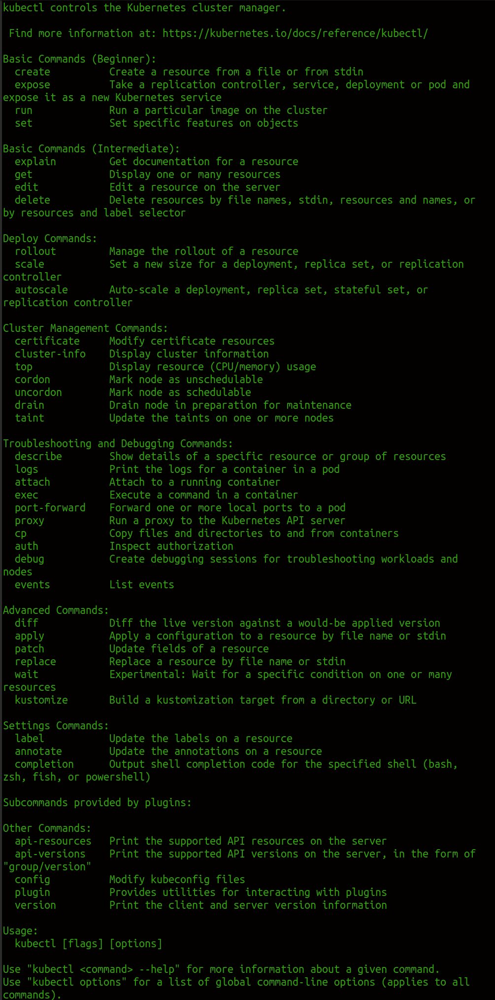
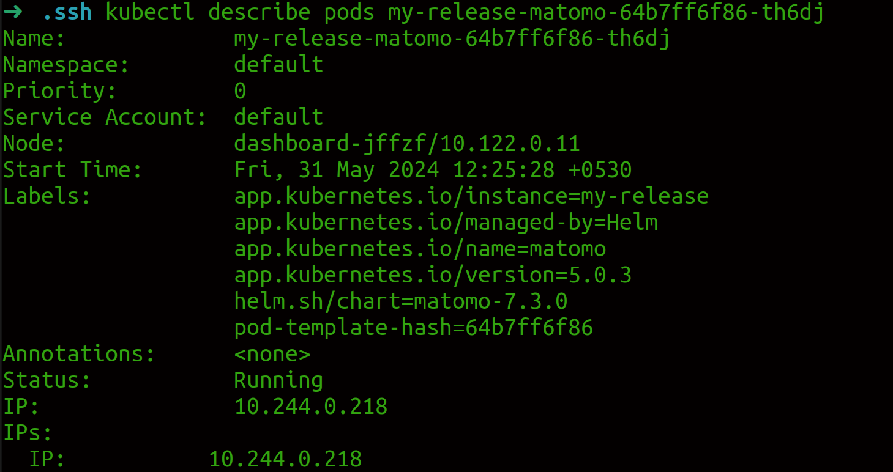
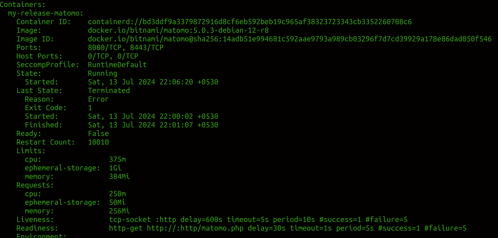
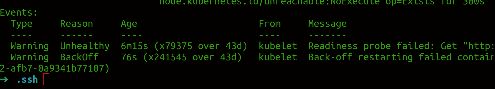

# K8s notes

## Checking cluster status

``` kubectl version ```

version of local kubectl tool as well as version of k8s api server.

### Simple diagnostic for the cluster.

``` kubectl get componentstatuses ```

### Listing K8S Nodes

``` kubectl get nodes ```

To list all the nodes in the cluster

``` kubectl describe nodes kube1 ```

To get more informations about a specific node such as kube 1

## Cluster Components

### Kubernetes Proxy

The Kubernetes proxy is responsible for routing network traffic to load-balanced
services in the Kubernetes cluster. To do its job, the proxy must be present on every
node in the cluster.
If your
cluster runs the Kubernetes proxy with a DaemonSet, you can see the proxies by
running:

``` kubectl get daemonSets --namespace=kube-system kube-proxy ```

### Kubernetes DNS

* Provides naming discovery for the service that are defined in the cluster.
* Runs as replicated server
* No of DNS is depends upon size of cluster 1 or more..
* it also run as k8s deployment

``` kubectl get deployments --namespace=kube-system core-dns ```

* k8s service also performs load balancing for the DNS server

``` kubectl get services --namespace=kube-system core-dns ```

### Kubernetes UI

* to visulize the cluster

# Common kubectl commands

## Namespaces

* Used to organize objects in the cluster.
* Default kubectl command-line interact with default namespace

``` --namespace=mystuff```
``` -n``` flag
```--all-namespaces```

## Contexts

* if you want to change default namespace more permanently you can set it in context it will be in $HOME/.kube/config 

``` kubectl config set-context my-context --namespace=mystuff ```

creates new context, to start using it use

``` kubectl config use-context my-context ```

### Viewing Kubernetes API Objects

* Everything in k8s is represented by a RESTful resource
* Each k8s object exists at a unique HTTP path example, https://your-k8s.com/api/v1/name‐spaces/default/pods/my-pod leads to the representation of a Pod in the default name‐space named my-pod

* To extracting specific fiels from kubectl

``` kubectl get pods my-pod -o jsonpath --template={.status.podIP} ```

* To view multiple objects of different types

``` kubectl get pods,services ```

* To get more details info

``` kubectl describe <resource-name> <obj-name> ```

* To see list of supported fields for each supported type of k8s object, use explain command

``` kubectl explain pods ```

### Creating, Updating, and Destroying Kubernetes Objects

* Objects in k8s API are represented as JSON or YAML files.
* This files can be returned by the server in response of query or posted to the server as part of an API request.
* We can use YAML or JSON files to create, update or delete objects on the k8s cluster.

``` kubectl apply -f obj.yaml ```

* No need to specify resource type of the object. it's obtained from the object file itself.
* To update the object

``` kubectl apply -f obj.yaml ```

* You can repeatedly use apply to reconcile state
* If you want what the apply command do without actually making the changes. Use ``` --dry-run ``` flag to print the objects to the terminal without actually sending them to the server.

* To make interactive edits instead of editing local file. use,

``` kubectl edit <resource-name> <obj-name> ```

* After you save the file, it will be automatically uploaded back to the k8s cluster.

The apply command also records the history of previous configurations in an annotation within the object. You can manipulate these records using ``` edit -last-applied ``` , ``` set-last-applied ``` and ``` view-last-applied ```

``` kubectl apply -f myobj.yaml view-last-applied ``` Show the last state that was applied
``` kubectl delete -f obj.yaml ``` to delete and obj
``` kubectl delete < resource-name > <obj-name> ``` to delete resource with type and name.

### Labeling and Annotating Objects

* tags for objects
* to update labels and annotations on any k8s use ``` label ``` and ``` anotate ``` command.

``` kubectl label pods bar color=red ```

* To remove label use ``` <label-name>- ```

``` kubectl label pods bar color- ```

### Debugging Commands

* To see logs of running conatainers ``` kubectl logs <pod-name> ```
* -c for multiple containers
* -f for following the logs

* ``` exec ``` to execute command in a running container

``` shell
 kubectl exec -it <pod-name> -- bash 
 ```

### Cluster management

* kubectl can be used to manage cluster itself. 

* ``` cordon ``` it will prevent pods being scheduled in a particular node in the future
* ``` drain ``` Remove existing pods from the node
* ``` uncordon ``` to re-enable pods scheduling onto the node.

It can be used for removing physical machine for repairs and upgrades. in that scenario we can use ``` kubectl cordon ``` followed by ``` kubectl drain ``` to safely remove machine from the cluster. we can use ``` kubectl uncordon ``` to renable it.
It's not required for something quick affecting a node (machine reboot). Only required when service out for long enough.

### Command Autocompletion

kubectl supports integration with your shell to enable tab completion for both
commands and resources. Depending on your environment, you may need to install
the bash-completion package before you activate command autocompletion. You
can do this using the appropriate package manager:
* macOS
``` shell 
brew install bash-completion
```
* CentOS/Red Hat
``` shell
 yum install bash-completion 
 ```
* Debian/Ubuntu
``` shell 
apt-get install bash-completion 
```
When installing on macOS, make sure to follow the instructions from brew about
how to activate tab completion using your ${HOME}/.bash_profile.
Once bash-completion is installed, you can temporarily activate it for your terminal
using:
``` shell 
source <(kubectl completion bash) 
```
To make this automatic for every terminal, add it to your ${HOME}/.bashrc file:
``` shell 
echo "source <(kubectl completion bash)" >> ${HOME}/.bashrc 
```
### Alternative ways of viewing a cluster

* You can also utilize other plugins like vs code, intelliJ, Eclipse

use ``` kubectl help ``` for more info.



## Pods

### Pods in Kubernetes

A Pod is a collection of application containers and volumes running in the same execution environment.
It is the smallest deployable artifact in a k8s cluster.

### Thinking with Pods

What should I put in a POD ?

* WordPress container + MySQL database container = WordPress instance. This kind of pod is actually an antipattern for pod construction.
* the scaling startegy for both them are different and won't fit for eachother

Ask will these contaners work correctly if they land on different machines ? if the answer is no . The pod is the correct grouping fo the containers. 
If answer is yes, Using multiple pods is probably the correct solution.

### Creating a POD

* simplest way to create a pod with ``` kubectl run ```

``` shell
kubectl run kuard --generator=run-pod/v1 --image=gcr.io/kuar-demo/kuard-amd64:blue 
```

* see the node running

``` shell
kubectl get pods
```
* delete the node

``` shell
kubectl delete pods/kuard
```

### Creating Pod Manifest

* Can be created using YAML or JSON. But YAML is generally preferred since it's slightly more human-editable and support comments.
* It should be treated as the same way as source code.

``` yaml
# for creating kurad-pod.yaml
apiVersion: v1
kind: Pod
metadata:
name: kuard
spec:
containers:
- image: gcr.io/kuar-demo/kuard-amd64:blue
name: kuard
ports:
- containerPort: 8080
name: http
protocol: TCP
```

* Written recode of desired state is the best practice in the long run, especially for large teams with many applications.

### Running  Pods

* use `kubectl  apply` apply command to launch a single instance of kurd

``` shell
kubectl apply -f kurad-pod.yaml
```

##### How it works

1. The pod manifest will be submitted to the kubernetes API Server. 
2. The k8s system will then schedule that pod to run on a healthy node in the cluster, `kubelet` daemon will monitor it.

### Listing Pods

    kubectl get pods

### Pod Details

    kubectl describe pods kuard

* To get more details on pod
It contains 
basic information

Containers running in the pod

events related to the pod.


### Deleting a POD

* Delete either by name
    kubectl delete pods/kuard
* Or can use the same file to delete
    kubectl delete -f kuard-pod.yaml

* When you delete a pod it won't immediately killed. It has a termination grace period of 30 seconds. When pod is in that state it no longer receives new requests. This grace period is important for reliability becuase it allows the pods to finish any active requests that it may be in the middle of processing before it is terminated.

* when you delete a pod the data stored also gets deleted. If you want to persist data across mulitple instances of a pod, we need persistent Volumes

### Accessing Your POD

For various reasons including not limited too..

* Want to load the web service running in the pod
* To see logs to debug a problem
* To execute other commands inside the Pod to help debug

##### Getting more Information with Logs

* To understand what the application doing
``` shell
    kubectl logs kuard # download the current logs
    # -f flag to stream
    # --previous flag to get logs from previous instance of the container
```

* While it's useful for occasional debugging of containers in prodcution env, it's generally useful to use log aggregation service.

##### Running Commands in your Container with exec

``` shell
kubectl exec kuard -- date # to run a command

# -t flag for interactive session

kubectl exec -it kuard -- ash

```

#### Copying Files to and from containers

* Copying files from one container to another is antipattern. We should treat the contenct of a container as immutable.

* But sometimes it's the most immediate way to stop the bleeding and restore the service to health. since it is quicker than building, pushing, and rolling out a new image.

* But when you stop bleeding it is critically important that you immediately go and do the image build and rollout. Otherwise the local changes is made to the container is forgotten and overwritten by next rollout.

### Health Checks

* When we run a application as container in k8s it keep it alive by using a process `health check`. It checks the process is running or not. else it's restarts everything.

* But it's insuffieciet for deadlocks and all. since health check things that application is still running.

* To address this k8s introduced health checks for application `liveness`.

* It applies application specific logic, like loading a web page. Since it's application specific, we have to define them in pod manifest

##### Liveness Probe

* To check a process is up and running and just not restarted. It defined per container
[example for liveness probe](https://github.com/lijozech-12/k8s_study/blob/main/pod-definition-files/kuard-pod-health.yaml
)

``` yaml
livenessProbe:
    httpGet:
        path: /healthy
        port: 8080
    initialDelaySeconds: 5
    timeoutSeconds: 1
    periodSeconds: 10
    failureThreshold: 3
```

* Pod manifest uses an httpGet probe to perform an HTTP GET request against the /healthy endpoint on port 8080 of the kuard container.
* initialDelaySeconds = 5, it meand it won't be called until 5 seconds after all the containers in the pod are created.
* The probe must be respond within the 1-second timeout.
* The HTTP status code must be `200 < status code < 400 ` to consider it successful.
* K8s will call the probe every 10 sec. (periodSeconds).
* If probes fails more than 3 consecutive times, the container will fail and restart (failureThreshold).

Run the below commands to check it.

``` bash
kubectl apply -f kuard-pod-health.yaml

kubectl port-forward kuard 8080:8080

# it will give more details.
kubectl describe pods kuard
```

* There is 3 options for the restart policy
1. Always(the default)
2. OnFailure(restart only on liveness failure or nonzero process exit code)
3. Never

##### Readiness Probe

* Readiness means the container is ready to server user requests.
* Liveness checks if and application is running properly.
* Containers that fails readiness checks are removed from sevice load balancers.

##### Startup Probe

* Introduced k8s recently as an alternative way of managing slow-starting containers.
* When pod is started, the startup probe is run before any other probing of the pod is started.
* It proceeds until it either times out(in which case pod is restarted) or it succeeds, at which time the livness probes takes over.
* It enable you to poll slowly for a slow-starting container while also enabling a responsive liveness check once the slow-starting container has initilized.

##### Advanced Probe Configuration.

Probes in k8s have a number of advanced options, including
* How long to wait after pod startup to start probing
* How many failures should be considered a true failure
* How many successes are necessary to reset the failure count.
All of these configurations gets default values. But it is necessary for more advanced use cases such as pallication that are flaky or take long time to startup.

##### Other Types of Health Checks.

* It also supports tcpSocker health checks that open a TCP socker. If the connection succeds, the probe succeeds. 
* It is useful for non-HTTP applications, such as databases or other non-HTTP-based APIs.
* If the script return a zero exit code, the probe succeeds otherwise it fails.
* It is more useful for custom application validation logic that doesn't fit neatly into an HTTP Call

### Resource Management

* People move into containers and orchestors like kubernetes because of the radical improvements in image packaing and reliable deployment they provide.
* In addition to application-oriented primitives that simplify distributed system developement, equally important is that they allow you to increase the overall utilization of the compute nodes that make up the cluster.
* since the basic cost of operating a machine is same if it's idle or working
* Ensuring the machines are used maximally increase the effieciency of every dollar spent on infra.

* Efficiency is measured with utilization metric. 
* Utilization metric = Amount resource actively being used / Amount of a resource that has been purchased.
* K8s can drive utilization greater than 50%.
* To do that we need to tell k8s the resource the application requires so that k8s can find the optimal packing of containers onto machines.

K8s allow users to specify 2 different metrics.

* Resource requests = minimum amount of resource required to run the application
* Resource limits = maximum amount of resource that an application can consume.

#### Resource Requests: Minimum Required Resources.

When a requests the resources required to run its containers, kubernets guarantees that resources are available to the Pod.
The most commonly requested resources are CPU and memory. But it also supports GPUs.

``` yaml
apiVersion: v1
kind: Pod
metadata:
  name: kuard
spec:
  containers:
    - image: gcr.io/kuar-demo/kuard-amd64:blue
      name: kuard
      resources:
        requests:
          cpu: "500m"
          memory: "128Mi" #0.5 cpu and 
      ports:
        - containerPort: 8080
          name: http
          protocol: TCP

```

* Kubernetes scheduler will ensure that the sum of all requests of all pods on a node does not exceed the capacity of the node
* Pod is guaranteed to have at least the requested resources when running on the node.
* This only gives idea of minimum resources not the maximum resource.
* If a second Pod with the same container and the same request of 0.5 CPU lands
on the machine, then each Pod will receive 1.0 cores. If a third, identical Pod is
scheduled, each Pod will receive 0.66 cores. Finally, if a fourth identical Pod is
scheduled, each Pod will receive the 0.5 core it requested, and the node will be at
capacity.

* if the memory request is over OS can't just remove memory from the process, because it's been allocated. When system runs out of memory, the kubelet terminates containers whose memory usage is greater than their requested memory. The container is automatically restarted, but with less available memory on the machine for the container to consume.

#### Capping Resource Usage with Limits

* To set a maximum on a it's resource usage via resource limits

``` yaml
apiVersion: v1
kind: Pod
metadata:
  name: kuard
spec:
  containers:
    - image: gcr.io/kuar-demo/kuard-amd64:blue
      name: kuard
      resources:
        requests:
          cpu: "500m"
          memory: "128Mi"
        limits:
          cpu: "1000m"
          memory: "256Mi"
  ports:
    - containerPort: 8080
      name: http
      protocol: TCP
```
* When we establisth limits on a container, the kernal is configured to ensure that consumption cannot exceed these limits.


### Persisting Data with Volumes.

* Having access to persistent disk storage is an important part of a healthy application

#### Using Volumes with Pods

To add volume we need to add 2 stanzas to add to our configuration.
* spec.volumes section. It defines all of the volumes that may be accessed by containers in the Pod manifest.

* `volumeMounts` array in the container definition. This array defines the volumes that are mounted into a particular container and path where each volume should be mounted.

``` bash
#kuard-pod-vol.yaml
apiVersion: v1
kind: Pod
metadata:
  name: kuard
spec:
  volumes: # adding volumes
  - name: "kuard-data"
    hostPath:
      path: "/var/lib/kuard"
  containers:
    - image: gcr.io/kuar-demo/kuard-amd64:blue
      name: kuard
      volumeMounts: # Mounting data from container to volumn
      - mountPath: "/data"
        name: "kuard-data"
      ports:
      - containerPort: 8080
        name: http
      protocol: TCP

```
##### Different Ways of Using Volumes with Pods

Following are the recommended pattern to use data in our application

###### Communication/synchronization

- two containers uses a shared volume to serve a site while keeping synchronized to a remote git location.
* to achieve this use `emptyDir` volume. Scoped to pod's lifespan.

###### Cache

* Volume that is valuable for performance, but necessary for performance.
* This will survive container restart due to health-check failures. 
* `emptyDir` also works well with cache use case as well

###### Persistent data

* Data that is independent of the lifespan of a particulat Pod.
* Should move b/w node in the cluster if a  node fails or a Pod move to a different machine.
* K8s support wide variety of remot storage volumes. Amazon Elastic Block store, Azure File and Azure Disk and Google's Persistent Disk


###### Mounting the host filesystem

* Some application don't need persistent volume.
* They need to access to the the /dev filesystem to perform raw block-level access to a device on the system.
* K8s support `hostPath` volume. which can mount arbitrary locations on the worker node into container

### Putting it together

``` bash

apiVersion: v1
kind: Pod
metadata:
  name: kuard
spec:
  volumes:
    - name: "kuard-data"
      nfs:
        server: my.nfs.server.local
        path: "/exports"
  containers:
    - image: gcr.io/kuar-demo/kuard-amd64:blue
      name: kuard
      ports:
        - containerPort: 8080
          name: http
          protocol: TCP
      resources:
        requests:
          cpu: "500m"
          memory: "128Mi"
        limits:
          cpu: "1000m"
          memory: "256Mi"
      volumeMounts:
        - mountPath: "/data"
          name: "kuard-data"
      livenessProbe:
        httpGet:
          path: /healthy
          port: 8080
        initialDelaySeconds: 5
        timeoutSeconds: 1
        periodSeconds: 10
        failureThreshold: 3
      readinessProbe:
        httpGet:
          path: /ready
          port: 8080
        initialDelaySeconds: 30
        timeoutSeconds: 1
        periodSeconds: 10
        failureThreshold: 3

```

## 6 Labels and Annotations

* We can organize, mark and cross-index all of your resources to represent the groups that make the most sense for your application.

* Labels are key/value pairs that can be attached to k8s objects such as pods and replicasets. It is useful for attaching identifyin ginformtion to k8s object.

* Annotations, on the other hand provide a storage mechanisum that resembles lables:key/value pairs designed to hold nonidentifyin information that tools and libraries can leverage. annotation are not meant for qureying, filtering, or otherwise differentiating pods from each other.

### Labels

* provides identifying metadat for objects
* These are fundamental qualities of the object that will be usef for grouping, viewing and opertaing

#### Applying Labels

First, create the alpaca-prod deployment and set the ver, app, and env labels:

```bash
$ kubectl run alpaca-prod \
--image=gcr.io/kuar-demo/kuard-amd64:blue \
--replicas=2 \
--labels="ver=1,app=alpaca,env=prod"
```

Next, create the alpaca-test deployment and set the ver, app, and env labels with
the appropriate values:

```bash
$ kubectl run alpaca-test \
--image=gcr.io/kuar-demo/kuard-amd64:green \
--replicas=1 \
--labels="ver=2,app=alpaca,env=test"
```

Finally, create two deployments for bandicoot. Here we name the environments prod
and staging:

```bash
$ kubectl run bandicoot-prod \
--image=gcr.io/kuar-demo/kuard-amd64:green \
--replicas=2 \
--labels="ver=2,app=bandicoot,env=prod"
$ kubectl run bandicoot-staging \
--image=gcr.io/kuar-demo/kuard-amd64:green \
--replicas=1 \
--labels="ver=2,app=bandicoot,env=staging"
```

At this point, you should have four deployments—alpaca-prod, alpaca-test,
bandicoot-prod, and bandicoot-staging:

```bash
$ kubectl get deployments --show-labels
NAME                      ... LABELS
alpaca-prod               ... app=alpaca,env=prod,ver=1
alpaca-test               ... app=alpaca,env=test,ver=2
bandicoot-prod            ... app=bandicoot,env=prod,ver=2
bandicoot-staging         ... app=bandicoot,env=staging,ver=2
```


#### Modifying Labels

* we can apply or update labels after we create them

``` bash
kubectl label deployments alpaca-test "canary=true"
```

* -L option to show a label value as a column

```bash
$ kubectl get deployments -L canary

```
* To remove label apply

```bash
kubectl label deployments alpaca-test "canary-"
```

#### Label Selectors

* used to filter k8s object based on a set of labels

```bash

#returns labels with ver label set to 2

kubectl get pods --selector="ver=2"

# If two selectors separated by a comma, only the objects that satisfy both will be returned.

kubectl get pods --selector="app=bandicoot,ver=2"

# To select label is one of a set of values.

kubectl get pods --selector="app in (alpaca,bandicoot)"

## all the deployments with the canary label set

kubectl get deployments --selector="canary"

```


#### Label Selectors in API Object

```bash
selector:
  matchLabels:
    app: alpaca
  matchExpressions:
    - {key: ver, operator: In, values: [1, 2]}
```

### Annotations

* Provides additional metadata for kuberenets objects where the sole purpose of the metadata is assisting tools and libraries

* labels are used to identify and group objects, annotations are used to provide extra information about where an object came from, how to use it, or policy around that object 

* The primary usecase is being rolling deployments. During rolling deployments, annotations are used to track rollout status and provide the necessary information required to rollback a deployment to a previous state.

Annotations are defined in the common metadata section in every Kubernetes object:

```bash
metadata:
annotations:
example.com/icon-url: "https://example.com/icon.png"
```

## 7 Service Discovery

The dynamic nature of k8s makes it easy to run lot of things, it also creates problems when it comes to finding those things. Most of the traditional network infrastructure wasn't built for the level of dynamism that kubernetes presents

The general name for this class of problems and solution is `service discovery`.

* It helps to finding which processes are listening at which addresses for which services. Good service-discovery system will help to resolve this information quickly and reliably.

* The `Domain Name System(DNS)` is the traditional system of service discovery on the interent

### The Service Object

* Service discover in k8s start with a `Service object`. A service object is a way to create a named label selector.

* `kubectl expose` to create service. just as the `kubectl run` command.

``` bash
$ kubectl create deployment alpaca-prod \
--image=gcr.io/kuar-demo/kuard-amd64:blue \
--port=8080
$ kubectl scale deployment alpaca-prod --replicas 3
$ kubectl expose deployment alpaca-prod
$ kubectl create deployment bandicoot-prod \
--image=gcr.io/kuar-demo/kuard-amd64:green \
--port=8080
$ kubectl scale deployment bandicoot-prod --replicas 2
kubectl expose deployment bandicoot-prod
$ kubectl get services -o wide
NAME              CLUSTER-IP    ... PORT(S)   ... SELECTOR
alpaca-prod       10.115.245.13 ... 8080/TCP  ... app=alpaca
bandicoot-prod    10.115.242.3  ... 8080/TCP  ... app=bandicoot
kubernetes        10.115.240.1  ... 443/TCP   ... <none>
```

* 2 service created by us and 1 service created by k8s

#### Service DNS

* Because the cluster IP is virtual it is table, and it is approriate to give it a DNS address. All of the issues around clients caching DNS results no longer apply
* It is easy to connect to one of the pods identified by service
* K8s provides a DNS service exposed to pods running in the cluster. This K8s DNS service was installed as a system component when the cluster was first created.

#### Readiness Checks

* Often, when an application first starts up, it isn't ready to hancel requests. There i usually some amount of initializtion that can take anywhere from under a second to several minutes.
* One nice thing the service object does is track which of your pods are ready via a readinesss check.

```bash
kubectl edit deployment/alpaca-prod
```
* The above command will fetch the current version of alpaca-prod deployment and bring it up in an editor, it'll write the object back to k8s. Quick way to edit an objce without saving it to a YAML file

```bash
spec:
  ...
  template:
    ...
    spec:
      containers:
      ...
      name: alpaca-prod
      readinessProbe:
        httpGet:
          path: /ready
          port: 8080
        periodSeconds: 2
        initialDelaySeconds: 0
        failureThreshold: 3
        successThreshold: 1
```

* This will check readiness via an HTTP GET to /ready on port 8080
* Done in every 2 seconds starting as soon as the Pod comes up
* If 3 successive checks fil, then the Pod will be considered not ready.IF 1 check succeds, the Pod will again be considered ready.
* Only ready pods are sent traffic.

Updating the deployment definition like this will delete and re-create the `alpaca Pods`. We need to restart our `port-forward` command from earlier

```bash
$ ALPACA_POD=$(kubectl get pods -l app=alpaca-prod \
-o jsonpath='{.items[0].metadata.name}')
$ kubectl port-forward $ALPACA_POD 48858:8080
```


* In another terminal start `watch` command on the endpoint for the `alpaca-prod` service. Endpoints are a lower-level way of finding what a service is sending traffic to and are covered later in the chapter

```bash
kubectl get endpoints alpaca-prod --watch
```


When we return the browser and hit the fail link for the readiness check. 

### Looking Beyond the Cluster

* We need allow traffic into the cluster. Not just exposing service inside the cluster.
* The most portable way to do this is to use a feture called NodePorts, which enhance a a service even further.
* In addition to a cluster IP, the system picks a port (or the user can specify one), and every node in the cluster then forwards traffic to that port to the service.
* With this feature, if you can reach any node in the cluster, you can contact a service. 
* we can use NodePort without knowing where any of the Pods for that service are running. This can be integrated with hardware or software load balancers to expose the service further

Try this out by modifying the alpaca-prod service:
```bash 
$ kubectl edit service alpaca-prod
```
Change the spec.type field to NodePort. You can also do this when creating the
service via kubectl expose by specifying --type=NodePort. The system will assign a
new NodePort:


* The system assigned 32711 to this service.


### Load Balancer Integration

* If you have a cluster that is configured to integrate with external load balancers, you can use the `LoadBalancer` type.
* This builds on the `NodePort type by additionally configuring the cloud to create a new load balancer and direct it at nodes in your cluster.
* Most cloud-based K8s clusters offer load balancer integration, and there are a no of projects that implement load balancer integrationf for common physical load balancers as well.

* Edit the alpaca-prod service agian `kubectl edit service alpaca-prod` and change spec.type to `LoadBalancer`.


* Here we can see `192.168.5.15` is now assigned to the alpaca-prod service.


### Advanced Details

* K8s is built to be an extensible system. As such, there are layers that allow for more advanced integrations. Understanding the details of how a sophisticated concept liek services is implemented may help you troubleshoot or create more advanced integrations.

#### Endpoints

* Some application(and the system itself) want to be ale to use services without using a cluster IP. This is done with another type of object called an Endpoints object.
* This is done with another type of object called an Endpoints object.

``` kubectl describe endpoints alpaca-prod  ```

* To use a service, an advanced application can talk to the k8s API directly to look up endpoints and call them. The K8s API even has the capability to "watch" objects and be notified as soon as they change. In this way, a client can react immediately as soon as the IPs associated with a service change.

#### Manual Service Discovery

K8s is built on top of label selectors over Pods. That means that you can use the K8s API to do rudimentary service discovery without using a Service object at all!. 
 
```
 $ kubectl get pods -o wide --selector=app=alpaca
 NAME                         ... IP          ...
 alpaca-prod-3408831585-bpzdz ... 10.112.1.54 ...
 alpaca-prod-3408831585-kncwt ... 10.112.2.84 ...
 alpaca-prod-3408831585-l9fsq ... 10.112.2.85 ...
 ```

We can always find the pods we are interested in using labels

#### Kube-proxy and Cluster IPs

 
 Cluster IPs are stable virtual IPs that load balance traffic across all of the endpoints in a service. This magic is performed by a component running on every node in the cluster calledd the kube-proxy. \

 The kube-proxy watches for new services in the cluster via the API server. It then programs a set of `iptables` rules in the kernel of that host to rewrite the destinations of packets so they are directed at one of the endpoints for that service. If the set of endpoints for a service changes (due to Pods coming and going or due to a failed readiness check), the set of `iptables` rules are rewritten.

 Cluster IP is usually assigned by the API server as the service is created. But when user can specify a specific cluster IP when creating. But it cannot be modified without deleting and re-creating the Service Object.

#### Cluster IP Environment Variables.

Using DNS services to find cluster IPs is the normal method. There are some older mechanisms that may still be in user. One of these is injecting a set of environment variables into Pods as they start up.


### Connecting with Other Environments.

while it is great to have service discovery within your own cluster, many real-world applications actually require that you integrate more cloud native applications
deployed in kubernetes with applications deployed to more legacy environments. additionally you may need to integrate a k8s cluster in the cloud 
with infrastructure that has been deployed on-premise.

#### Connecting to Resources outside of a Cluster

When you are connecting k8s to legacy resources outside of the cluster, you can use selector-less services to k8s service with manually assigned
IP address that is outside of the cluster. That way, k8s service discovery via DNS works as expected, but the network traffic itself
flows to an external resource.

To create a selector-less service, you remove the `spec.selector` field from your resource, while leaving the `metadata` and the `ports`
sections unchanged. Becuase your service has no selector, no endpoints are automatically added to the service. This means that you must
add them manually. Typically the endpoint that you will add will be a fixed IP address (e.g, the IP address of your database server)
so you only need to add it once.

But if service ever changes, you will need to update the corresponding endpoint resource.

```
 apiVersion: v1
 kind: Endpoints
 metadata:
  # This name must match the name of your service
  name: my-database-server
 subsets:
  - addresses:
      # Replace this IP with the real IP of your server
      - ip: 1.2.3.4
    ports:
      # Replace this port with the port(s) you want to expose
      - port: 1433
```


#### Connecting External Resources to Service Inside a Cluster.

Connection external resouces to kuberenets services is somewhat trickier. If your cloud provider supports it, the easiest thing to do is to create an 
"internal" load balancer, as described above that lives in your VPN and deliver traffic from a fixed IP address into the cluster.
You can then use traditional DNS to make this IP address available to external resouces.

If the internal load balancer isn't available, you can use `NodePort` service to expose the service on the IP addresses of the nodes
in the cluster. You can then either  program a physical loadbalaner to serve traffic to those nodes, or use DNS-based load-balancing to
spread traffic between the nodes.

another complex option is include running the full kube-proxy on a external resource and progrmming that machine to use the DNS server
in the k8s cluster.


## 8 HTTP Load Balancing with Ingress

Normal k8s service operate at level 4 of OSI model. so only forward TCP and UDP connections and doesn't look inside those connections.
Because of this hosting many applications on a cluster uses many different exposed services. In the case where these services are type:
`NodePort`, you'll have to have clients connect to a unique port per service. In the case where these service are type: 'LoadBalancer' 
you'll be allocating (expensive) cloud resources for each service.

We can do virtual hosting that means hosting many HTTP sites on a single IP address.
It will accept incoming connections on HTTP(80) and HTTPS(443) ports. The program then parses the the connection based on the Host header 
and the URL path that is requested.

This HTTP based load-balancing system is called `Ingress`.

```
 apiVersion: networking.k8s.io/v1
 kind: Ingress
 metadata:
  name: path-ingress
 spec:
  rules:
  - host: bandicoot.example.com
    http:
      paths:
      - pathType: Prefix
        path: "/"
          backend:
            service:
              name: bandicoot
              port:
                number: 8080
      - pathType: Prefix
        path: "/a/"
        backend:
          service:
            name: alpaca
            port:
              number: 8080
 ```

 When there are multiple paths on the same host listed in the Ingress system, the longest prefix matches. So, in this example, traffic
 starting with /a/ is forwarded to the `alpaca` service, while all other traffic (starting with /) is directed to the bandicoot service.


### Multiple Ingress Objects.

If you specify multiple ingress objects, hte ingress controllers should read them all and try to merge them into a coherent configuration.

For duplicate and conflicting configurations the behaviour is undefined. It is likely that different ingress config will behave differently. 

Even single configuration will may do different things depending on nonobvious factors.

### Ingress and Namespaces.

Ingress interacts with namesapces in some nonobvious ways.
Due to an abundance of securiyt caution, ingress object can refer to only an upstream service in the same namespace. This means that you can't use an ingress object to point to subpath to a service in anothre namespace.


However multiple ingress object in different namesapces can specify subpaths for the same host. These ingress object are then merged to come up with the final config for the ingress controller.

### Path Rewriting. 

Some ingress controlled implementations support, optionally, doing path rewriting.
This can be used to modify the path in the HTTP request as it gets proxied.

This is usually specified by an annotation on the Ingress object and applies to all requests that are specified by that object.


For example, if we were using
 the NGINX Ingress controller, we could specify an annotation of `nginx.ingress
 .kubernetes.io/rewrite-target: /`. 
 
 Path rewriting introduce to bugs. Can sometimes show `/app-path` instead of `/sub-path`. Since web applications assume they can link withing themselves using absolute paths.

 For these reason it's best avoid subpath if you can't help it.


 ### Serving TLS

 When Serving websites, it is becoming increasingly necessary to do so securely using TLS and HTTPS. Ingress supports this ( as do most INgress controllers).


You can also create a Secret imperatively with
```
 kubectl create secret tls <secret-name> --cert <certificate-pem-file>--key <private-key-pem-file>
 ```

tls-secret.yaml

```
 apiVersion: v1
 kind: Secret
 metadata:
    creationTimestamp: null
    name: tls-secret-name
 type: kubernetes.io/tls
 data:
    tls.crt: <base64 encoded certificate>
    tls.key: <base64 encoded private key>
```

Once you have the certificate uploaded, you can reference it in an Ingress object. Again, if multiple ingress objectes specify certificates for the same hostnamem, the behaviour is undefined.

tls-ingress.yaml

```
 apiVersion: networking.k8s.io/v1
 kind: Ingress
 metadata:
    name: tls-ingress
 spec:
  tls:
    - hosts:
      - alpaca.example.com
      secretName: tls-secret-name
  rules:
  - host: alpaca.example.com
    http:
      paths:
      - backend:
          serviceName: alpaca
          servicePort: 8080
```

Uploading and managing TLS secretes can be difficult come with cost.

Use non-profie "Let's Encrypt" running a free certificate authoriy that is API-Driven. since it is API-Driven, it is possible to set up a K8s cluster that automatically fetches and installs TLS certificates for you.
also use 'certmanager'

### Alternate Ingress Implementations.

The most popular generic Ingress controller is probably the open source NGINX
 Ingress controller. Be aware that there is also a commercial controller based on the
 proprietary NGINX Plus. The open source controller essentially reads Ingress objects
 and merges them into an NGINX configuration file. It then signals to the NGINX
 process to restart with the new configuration (while responsibly serving existing
 in-flight connections). The open source NGINX controller has an enormous number
 of features and options exposed via annotations.


## 9 ReplicaSets

Redundancy
  Failure toleration by running multiple instances.
Scale
 Higher request-processing capacity by running multiple instances.
Sharding
 Different replicas can handle different parts of a computation in parallel.

Replicaset act as a cluster wide Pod manager


### Reconciliation Loops

Reconciliation loop is constantly running, observing the current stat of the world and taking action to try to make the observed state match teh desired state.

There are many benefits to the reconciliation-loop approach to managing state. It is an inherently goal-driven, self-healing system, yet it can often be easily expressed in a few lines of code.

even thought the reconciliation loop for RS is a single loop, yet it handles user actions to scale up or scale down the RS as well as node failures or node rejoining the cluster after being absent.


### Relating Pods and ReplciaSets

Decoupling is the theme of k8s. all core concepts of k8s are modular with respect to each other and that they are swappable and replaceable with other components.

Relations b/w RS and pods are loosely coupled. RS do not own the pods they create.

RS uses label queries to find out the pods they are managing. 

RS that create multiple pods and the services that load balance to those pods are also totally seperate, decoupled API objects.
Decoupling pods and RS enables several important behaviours, discussed in the following sections.

##### Adopting Existing Containers.

Since RS is decoupled with pods it  can adopt an existing pods and scale out additonal copies of those containers. Like that we move from single imperative pod to a replicated set of pods managed by a RS.

##### Quarantining Containers.

Pod-level health check will automatically restart a pod when server misbehving. But if the health checks are incomplete the pods will be part of replicated set. 
IF we kill the pod that would leave them with only logs to debug the problem.
Instead you can modify the set of labels on the sick Pod. Doing so will disassociate it from the RS and service sot that you can debug the pod.

RS will notice the pod is missing and create a new pod. But since the pod is still running it is available to developer for interactive debugging, which significantly more valuable than debugging from logs.


### Designing with ReplicasSets.

RS is designed for stateless services.

### Replicaset Spec

All replciaset should have unique name. `metadata.name`

```
 apiVersion: apps/v1
 kind: ReplicaSet
 metadata:
  labels:
    app: kuard
    version: "2"
  name: kuard
 spec:
  replicas: 1
  selector:
    matchLabels:
      app: kuard
      version: "2"
  template:   #pod template in replica set
    metadata:
      labels:
        app: kuard
        version: "2"
    spec:
      containers:
        - name: kuard
        image: "gcr.io/kuar-demo/kuard-amd64:green"
 ```


###### IMportant commands

```bash
#creating RS

kubectl apply -f kuard-rs.yaml

kubectl get pods 

# Inspecting a ReplicaSet

kubectl describe rs kuard

# Finding a RS from a Pod

Kubectl get pods <pod-name> -o=jsonpath='{.metadata.ownerReferences[0].name}'

# Finding a set of pods for a ReplicaSet

kubectl get pods -l app=kuard,version=2

#Imperative scaling with kubectl scale

kubectl scale replicasets kuard --replicas=4

```

### Autoscaling a ReplicaSet

Autoscaling requires a metric-server in your cluster. The metrics-server keeps track of metrics and provides an API for consuming metrics that HPA uses when making scaling decisions.

```bash
kubectl autoscale rs kuard --min=2 --max=5 --cpu-percent=80
 ```

## 10 Deployments

Helps to rollout

Deployment can be represented as a declarative YAML object that provides the details about what you want to run.

It will help to move from one version easily.

Since the deployment controller runs on server side or k8s cluster itself. This means you can do rollout even from place without proper interent
connectivity

Like even from a phone

deployment.yaml
```
 apiVersion: apps/v1
 kind: Deployment
 metadata:
  name: kuard
  labels:
    run: kuard
 spec:
  selector:
    matchLabels:
      run: kuard
  replicas: 1
  template:
    metadata:
      labels:
        run: kuard
    spec:
      containers:
      - name: kuard
        image: gcr.io/kuar-demo/kuard-amd64:blue

```

```bash

# for creating deployment
kubectl create -f kuard-deployment.yaml


PS D:\My_projects\k8s_study\yamlfiles\10Deployments> kubectl get deployments kuard -o jsonpath --template "{.spec.selector.matchLabels}"  
{"run":"kuard"}

# The deployments also contains the RS.

PS D:\My_projects\k8s_study\yamlfiles\10Deployments> kubectl get replicasets --selector=run=kuard
NAME               DESIRED   CURRENT   READY   AGE
kuard-558d489dd5   1         1         1       6m10s


# Scaling the Deployment

PS D:\My_projects\k8s_study\yamlfiles\10Deployments> kubectl scale deployments kuard --replicas=2
deployment.apps/kuard scaled
PS D:\My_projects\k8s_study\yamlfiles\10Deployments> kubectl get deployments kuard
NAME    READY   UP-TO-DATE   AVAILABLE   AGE
kuard   2/2     2            2           7m8s

# To get more details on deployments

PS D:\My_projects\k8s_study\yamlfiles\10Deployments> kubectl describe deployments kuard
Name:                   kuard
Namespace:              default
CreationTimestamp:      Thu, 07 Nov 2024 23:39:40 +0530
Labels:                 run=kuard
Annotations:            deployment.kubernetes.io/revision: 1
Selector:               run=kuard
Replicas:               2 desired | 2 updated | 2 total | 2 available | 0 unavailable
StrategyType:           RollingUpdate
MinReadySeconds:        0
RollingUpdateStrategy:  25% max unavailable, 25% max surge
Pod Template:
  Labels:  run=kuard
  Containers:
   kuard:
    Image:        gcr.io/kuar-demo/kuard-amd64:blue
    Port:         <none>
    Host Port:    <none>
    Environment:  <none>
    Mounts:       <none>
  Volumes:        <none>
Conditions:
  Type           Status  Reason
  ----           ------  ------
  Progressing    True    NewReplicaSetAvailable
  Available      True    MinimumReplicasAvailable
OldReplicaSets:  <none>
NewReplicaSet:   kuard-558d489dd5 (2/2 replicas created)
Events:
  Type    Reason             Age    From                   Message
  ----    ------             ----   ----                   -------
  Normal  ScalingReplicaSet  9m8s   deployment-controller  Scaled up replica set kuard-558d489dd5 to 1
  Normal  ScalingReplicaSet  2m11s  deployment-controller  Scaled up replica set kuard-558d489dd5 to 2 from 1


```


Even thought we can scale the deployment using kubectl scale command(imperatively). It's better to do it using YAML files ( Declratively). 
```
# Like changing this
spec:
  replicas: 3
```

Then run ``` Kubectl apply -f kuard-deployment.yaml ```

We can Also Update the container image

```bash

#change the following in the file 
      containers:
      - image: gcr.io/kuar-demo/kuard-amd64:green
        imagePullPolicy: Always

# and run the below commands
PS D:\My_projects\k8s_study\yamlfiles\10Deployments> kubectl apply -f .\kuard-deployment.yaml
deployment.apps/kuard configured
PS D:\My_projects\k8s_study\yamlfiles\10Deployments> kubectl get pods
NAME                     READY   STATUS              RESTARTS   AGE
kuard-558d489dd5-5jsk8   1/1     Running             0          6s
kuard-558d489dd5-mjzcj   1/1     Running             0          6s
kuard-558d489dd5-vhn24   1/1     Running             0          19m
kuard-7b47775588-5vd29   0/1     ContainerCreating   0          6s
PS D:\My_projects\k8s_study\yamlfiles\10Deployments> kubectl get pods
NAME                     READY   STATUS    RESTARTS   AGE
kuard-7b47775588-5vd29   1/1     Running   0          16s
kuard-7b47775588-flsnw   1/1     Running   0          9s
kuard-7b47775588-mhxf7   1/1     Running   0          8s


# You can see the image changed from blue to green

PS D:\My_projects\k8s_study\yamlfiles\10Deployments> kubectl get deployments kuard -o jsonpath --template "{.spec.template.spec.containers}"      
[{"image":"gcr.io/kuar-demo/kuard-amd64:green","imagePullPolicy":"IfNotPresent","name":"kuard","resources":{},"terminationMessagePath":"/dev/termination-log","terminationMessagePolicy":"File"}]


# if you wanna rollout the changes
kubectl rollout pause deployments kuard

# if you wanna pause the deployments rollout

kubectl rollout pause deployments kuard

# if you wann restart the roll out and found there is no issues in it.
kubectl rollout resume deployments kuard

```

If you wanna see the rollout happened and the details below the commands and the example outputs

```bash

PS D:\My_projects\k8s_study\yamlfiles\10Deployments>  kubectl rollout history deployment kuard
deployment.apps/kuard 
REVISION  CHANGE-CAUSE
1         <none>
2         <none>


PS D:\My_projects\k8s_study\yamlfiles\10Deployments> kubectl rollout history deployment kuard --revision=2
deployment.apps/kuard with revision #2
Pod Template:
  Labels:       pod-template-hash=7b47775588
        run=kuard
  Containers:
   kuard:
    Image:      gcr.io/kuar-demo/kuard-amd64:green
    Port:       <none>
    Host Port:  <none>
    Environment:        <none>
    Mounts:     <none>
  Volumes:      <none>


PS D:\My_projects\k8s_study\yamlfiles\10Deployments> kubectl rollout history deployment kuard --revision=1
deployment.apps/kuard with revision #1
Pod Template:
  Labels:       pod-template-hash=558d489dd5
        run=kuard
  Containers:
   kuard:
    Image:      gcr.io/kuar-demo/kuard-amd64:blue
    Port:       <none>
    Host Port:  <none>
    Environment:        <none>
    Mounts:     <none>
  Volumes:      <none>

  ```

To rollback to the change previous version use `kubectl rollout undo deployments kuard`

```bash
PS D:\My_projects\k8s_study\yamlfiles\10Deployments> kubectl rollout undo deployment kuard
deployment.apps/kuard rolled back
PS D:\My_projects\k8s_study\yamlfiles\10Deployments> kubectl rollout history deployment kuard             
deployment.apps/kuard 
REVISION  CHANGE-CAUSE
3         <none>
4         <none>

PS D:\My_projects\k8s_study\yamlfiles\10Deployments> kubectl rollout history deployment kuard --revision=4
deployment.apps/kuard with revision #4
Pod Template:
  Labels:       pod-template-hash=7b47775588
        run=kuard
  Containers:
   kuard:
    Image:      gcr.io/kuar-demo/kuard-amd64:green
    Port:       <none>
    Host Port:  <none>
    Environment:        <none>
    Mounts:     <none>
  Volumes:      <none>

PS D:\My_projects\k8s_study\yamlfiles\10Deployments>
```

We can also rollback to specific revision in the history using ``--to-revision``

```bash

PS D:\My_projects\k8s_study\yamlfiles\10Deployments> kubectl rollout undo deployments kuard --to-revision=3
deployment.apps/kuard rolled back
PS D:\My_projects\k8s_study\yamlfiles\10Deployments> kubectl rollout history deployment kuard              
deployment.apps/kuard 
REVISION  CHANGE-CAUSE
4         <none>
5         <none>

PS D:\My_projects\k8s_study\yamlfiles\10Deployments> kubectl rollout undo deployments kuard --to-revision=5
deployment.apps/kuard skipped rollback (current template already matches revision 5)
```

### Deployment Strategies

K8s Deployment supports 2 different rollout strategies, `Recreate` and `RollingUpdate`

#### Recreate Strategy

Simpler of the two. It simply updates the RS it managed to use the new image and terminates all of the Pods associated with the Deployment. The ReplicaSet notices that it no longer has any replcias and re-creates all Pods using the new image. Once the Pods are re-created, they are running the new version.

While this is simple and fast, it will result in workload downtime. 

It should be using only for test Deployments where a service downtime is acceptable

#### RollingUpdate Strategy

Generally preferable strategy for any user-facing service.

Slower than Recreates but more sophisticated and robust.

Using this we can rollout new version while still receiving user traffic, without any downtime.

It works by updating few pods at a time, moving incrementally until all of the pods are running the new version of your software.

##### Managing multiple versions of your service.

While doing rolling update it will cause your new version and old version are service will be receiving requests and serving traffic. 

This means you need to build a software where each of its clients, is capable of taling interchangeably with both a slightly older and slightly newer version of your sw.

You need to have maintain backward and forward compatibilty for reliable updates.

##### Configuring a rolling update

We can tune the `RollingUpdate` according to our needs.
There is two parameters `maxUnavailable` and `maxSurge`.

`maxUnavailabe` means the maximum no of pods that can be unavailable during a rolling update. It can either set for a absolute number (eg 3,4,5... ) or to percentage (eg. 20%, ) the percentage of replicas that can be unavailable. Using percentage is more good apporach. But if you want an absolute number you can using this.

It will help to tune how quickly rolling update will act. if you say `50%` it will tune down to `50%` of original size. and with on `50%` of service capacity at times.

If you want `100%` availabilty set to it `0` it will create additional resources and delete the old one. like if you desire 4 resource it with create 5-8 resource at a time (including old 4) and remove the old one.
We can control it using `maxSurge` parameters.

`maxSurge` can be a number or percentage.

##### Slowing Rollouts to Ensure Service Health.

Staged rollout are meant to ensure that the rollout results in a healthy, stable service running the new software version. To do this, the deployment controller alwasy waits until a pod reporst that it is ready before moving on to update the next pod.

But sometimes being ready is not give you suffiecinet confidence that pod is actually behaving correctly.
We can waith a period of time to have a high confidence that the new version is operatign correctly before you move on to updating the next pod

```bash
spec:
  minReadySeconds: 60
```

Setting minReadySeconds to 60 indicates that the Deployment must wait for 60
 seconds after seeing a Pod become healthy before moving on to updating the next
 Pod.

Also we can set a timeout that limits how long the system will wait. To help it out of a deadlocks. In the absence of timeout, the deployment controller will stall your rollout forever.

For having timeout period. we can give paramete progress DeadlineSeconds
```bash
 spec:
  progressDeadlineSeconds: 600
```

To delete deployement
```bash
kubectl delete deployments kuard

PS D:\My_projects\k8s_study\yamlfiles\10Deployments> kubectl delete -f .\kuard-deployment.yaml
deployment.apps "kuard" deleted
PS D:\My_projects\k8s_study\yamlfiles\10Deployments> kubectl get deployments
No resources found in default namespace.
PS D:\My_projects\k8s_study\yamlfiles\10Deployments>
```

## 11 DaemonSets

Replicating Pod on every node.
It is used to deploy system daemons such as log collectors and monitoring agents, which typically must run on every
node. 
It works like rs. both create Pods that are expected to be long-running services and ensure that the desired state and the observed state
of the cluster match.

RS should be used where the application is completely decoupled from the node and you can run multiple copies on
the give witout special consideration.

DaemonSet should used when copies should be run on all the nodes.

### DaemonSet scheduler

by default, daemonset will create a copy of a pod on every node unless a node selector is used, which will limited
elegible node to those with matching set of labels.

fluentd.yaml
```bash
 apiVersion: apps/v1
 kind: DaemonSet
 metadata:
  name: fluentd
  labels:
    app: fluentd
 spec:
  selector:
    matchLabels:
      app: fluentd
 template:
  metadata:
    labels:
      app: fluentd
  spec:
    containers:
    - name: fluentd
      image: fluent/fluentd:v0.14.10
      resources:
        limits:
          memory: 200Mi
        requests:
          cpu: 100m
          memory: 200Mi
      volumeMounts:
      - name: varlog
        mountPath: /var/log
      - name: varlibdockercontainers
        mountPath: /var/lib/docker/containers
        readOnly: true
    terminationGracePeriodSeconds: 30
    volumes:
    - name: varlog
      hostPath:
        path: /var/log
    - name: varlibdockercontainers
      hostPath:
        path: /var/lib/docker/containers
 ```

Applying the daemonset

```bash
PS D:\My_projects\k8s_study\yamlfiles\11DaemonSets> kubectl apply -f .\fluentd.yaml
daemonset.apps/fluentd created

PS D:\My_projects\k8s_study\yamlfiles\11DaemonSets> kubectl describe daemonset fluentd
Name:           fluentd
Selector:       app=fluentd
Node-Selector:  <none>
Labels:         app=fluentd
Annotations:    deprecated.daemonset.template.generation: 1
Desired Number of Nodes Scheduled: 1
Current Number of Nodes Scheduled: 1
Number of Nodes Scheduled with Up-to-date Pods: 1
Number of Nodes Scheduled with Available Pods: 1
Number of Nodes Misscheduled: 0
Pods Status:  1 Running / 0 Waiting / 0 Succeeded / 0 Failed

PS D:\My_projects\k8s_study\yamlfiles\11DaemonSets> kubectl get pods -l app=fluentd -o wide
NAME            READY   STATUS    RESTARTS   AGE   IP           NODE      NOMINATED NODE   READINESS GATES
fluentd-2r6fq   1/1     Running   0          8m    10.42.0.40   lijospc   <none>           <none>
```

### Limiting DaemonSets to Specific Nodes

Sometimes we need to deploy Pod to only a subset of nodes. Maybe someworkload that requires a GPU or access to fast storage only availale on a subest of nodes in you cluster. 
We can use node labels to tag specific nodes that meet workload requirements.

#### Adding Labels to Nodes

```bash
$ kubectl label nodes lijospc ssd=true
node/lijospc labeled

lijoz@LijosPC MINGW64 /d/My_projects/k8s_study/yamlfiles/11DaemonSets (main)
$ kubectl get nodes
NAME      STATUS   ROLES                  AGE    VERSION
lijospc   Ready    control-plane,master   6d7h   v1.30.6+k3s1

lijoz@LijosPC MINGW64 /d/My_projects/k8s_study/yamlfiles/11DaemonSets (main)
$  kubectl get nodes --selector ssd=true
NAME      STATUS   ROLES                  AGE    VERSION
lijospc   Ready    control-plane,master   6d7h   v1.30.6+k3s1
```

#### Node Selectors

nginx-fast-storage.yaml

```bash
apiVersion: apps/v1
kind: "DaemonSet"
metadata:
  labels:
    app: nginx
    ssd: "true"
  name: nginx-fast-storage
spec:
  selector:
    matchLabels:
      app: nginx
      ssd: "true"
  template:
    metadata:
      labels:
        app: nginx
        ssd: "true"
    spec:
      nodeSelector:
        ssd: "true"
      containers:
      - name: nginx
        image: nginx:1.10.0
```

```bash
lijoz@LijosPC MINGW64 /d/My_projects/k8s_study/yamlfiles/11DaemonSets (main)
$ kubectl apply -f nginx-fast-storage.yaml
daemonset.apps/nginx-fast-storage created

lijoz@LijosPC MINGW64 /d/My_projects/k8s_study/yamlfiles/11DaemonSets (main)
$ kubectl get daemonsets
NAME                 DESIRED   CURRENT   READY   UP-TO-DATE   AVAILABLE   NODE SELECTOR   AGE
fluentd              1         1         1       1            1           <none>          22m
nginx-fast-storage   1         1         0       1            0           ssd=true        16s
```

#### Updating a DaemonSet

It work similarily like rolling update in deployments.

`spec.minReadySeconds`
  Determines how long a Pod must be “ready” before the rolling update proceeds
  to upgrade subsequent Pods

`spec.updateStrategy.rollingUpdate.maxUnavailable`
  Indicates how many Pods may be simultaneously updated by the rolling update

## 12 Jobs

While long-running processes makeup the large majority of workloads that run on a k8s cluster, there is often a need to run short-lived, one-off tasks. The Job object is made for handling these types of tasks.

Job creates a pod until successful termination (for instance, exit with 0).
In regular pod will continually restar regardless of it's exit code. 
Jobs are useful for things you only want to do once, such as database migrations or batch jobs. If you run a pod task would run in a loop, cotinually repopulating the database after every exit.

### The Job Object

The Job object is responsible for createing and managing pods defined in a template in the job specifications. 
These pods generally run until successful completion.
The job object coordinates running a number of Pods in parallel.

If the Pod fails before successful termination, the job controller will create a new Pod based on the Pod template in the job specification.
The pod won't be scheduled fi scheduler does not find the required resources.
There is small chance that duplicate pods will be created for a specific task during certain failure scenarios.

### Job Patterns

Job pattern is defined by two primary attributes of a job: the number of job completions and the number of Pods to run in parallel. 
In the case of the "run once until completion" pattern, the `completions` and `parallelism` parameters are set to `1`.


#### One Shot

Way to run a single Pod once until successful termination. 

Work involved in pulling this off.

1. A pod must be created and submitted to the Kubernetes API. This is done using a Pod template defined in the job configuration.

2. Once a job is up and runnning the Pod backing the job must be monitored for successful termination.

3. A job can fail for any number reasons, including a application error, an uncaught exception during runtime, or a node failure before the job has a chance to complete.

4. In all cases, the job controller is responsible for re-creating the Pod until a successful temination occurs.

job-oneshot.yaml
```bash
 apiVersion: batch/v1
 kind: Job
 metadata:
  name: oneshot
 spec:
  template:
    spec:
      containers:
      - name: kuard
        image: gcr.io/kuar-demo/kuard-amd64:blue
        imagePullPolicy: Always
        command:
        - "/kuard"
        args:
        - "--keygen-enable"
        - "--keygen-exit-on-complete"
        - "--keygen-num-to-gen=10"
      restartPolicy: OnFailure
```

```bash
lijoz@LijosPC MINGW64 /d/My_projects/k8s_study/yamlfiles/12Jobs (main)


$ kubectl apply -f job-oneshot.yaml
job.batch/oneshot created

lijoz@LijosPC MINGW64 /d/My_projects/k8s_study/yamlfiles/12Jobs (main)


$ kubectl describe jobs oneshot
Name:             oneshot
Namespace:        default
Selector:         batch.kubernetes.io/controller-uid=6346894d-edad-4b65-b454-890bb3c41d13
Labels:           batch.kubernetes.io/controller-uid=6346894d-edad-4b65-b454-890bb3c41d13
                  batch.kubernetes.io/job-name=oneshot
                  controller-uid=6346894d-edad-4b65-b454-890bb3c41d13
                  job-name=oneshot
Annotations:      <none>
Parallelism:      1
Completions:      1
Completion Mode:  NonIndexed
Start Time:       Fri, 08 Nov 2024 20:00:13 +0530
Pods Statuses:    1 Active (1 Ready) / 0 Succeeded / 0 Failed
Pod Template:
  Labels:  batch.kubernetes.io/controller-uid=6346894d-edad-4b65-b454-890bb3c41d13
           batch.kubernetes.io/job-name=oneshot
           controller-uid=6346894d-edad-4b65-b454-890bb3c41d13
           job-name=oneshot
  Containers:
   kuard:
    Image:      gcr.io/kuar-demo/kuard-amd64:blue
    Port:       <none>
    Host Port:  <none>
    Command:
      /kuard
    Args:
      --keygen-enable
      --keygen-exit-on-complete
      --keygen-num-to-gen=10
    Environment:  <none>
    Mounts:       <none>
  Volumes:        <none>
Events:
  Type    Reason            Age   From            Message
  ----    ------            ----  ----            -------
  Normal  SuccessfulCreate  13s   job-controller  Created pod: oneshot-ndbh8


$ kubectl logs oneshot-ndbh8 
2024/11/08 14:30:16 Starting kuard version: v0.10.0-blue
2024/11/08 14:30:16 **********************************************************************
2024/11/08 14:30:16 * WARNING: This server may expose sensitive
2024/11/08 14:30:16 * and secret information. Be careful.
2024/11/08 14:30:16 **********************************************************************
2024/11/08 14:30:16 Config:
{
  "address": ":8080",
  "debug": false,
  "debug-sitedata-dir": "./sitedata",
  "keygen": {
    "enable": true,
    "exit-code": 0,
    "exit-on-complete": true,
    "memq-queue": "",
    "memq-server": "",
    "num-to-gen": 10,
    "time-to-run": 0
  },
  "liveness": {
    "fail-next": 0
  },
  "readiness": {
    "fail-next": 0
  },
  "tls-address": ":8443",
  "tls-dir": "/tls"
}
2024/11/08 14:30:16 Could not find certificates to serve TLS
2024/11/08 14:30:16 Serving on HTTP on :8080
2024/11/08 14:30:16 (ID 0) Workload starting
2024/11/08 14:30:18 (ID 0 1/10) Item done: SHA256:o0q8ziaFYXWUEKcb1g7kLZRgJVIj6N8VNIL+iXP5hH0
2024/11/08 14:30:20 (ID 0 2/10) Item done: SHA256:Ju5H9cahLhgg2n+AhbjAm3lbdqgJj7zyICls2TJ5+NY
2024/11/08 14:30:22 (ID 0 3/10) Item done: SHA256:pQpbQibmWFJmwdnUB7av5C7HAh8mJ/g0rQ9Fbzlwafs
2024/11/08 14:30:25 (ID 0 4/10) Item done: SHA256:hmv6qvWiNQkJGRsFU2eY75K9owVZmQc0AHSr47QUinU
2024/11/08 14:30:27 (ID 0 5/10) Item done: SHA256:c9FW0FBgV6YoRJWr8yb1Q/bAU3+1KvqfmOb9wVfMEP8
2024/11/08 14:30:29 (ID 0 6/10) Item done: SHA256:LxUS1xMtJIlogghsrDqLXZOWFyyWkemp+bYNfywPze4
2024/11/08 14:30:30 (ID 0 7/10) Item done: SHA256:hy51OYLn3r1p7AnHztDGB053lnc0/RPszeN2RHcAwys
2024/11/08 14:30:31 (ID 0 8/10) Item done: SHA256:X1j7mH1kHHFote3a/wkRoHlzUjt0Wsma9ruf9BWcdqY
2024/11/08 14:30:33 (ID 0 9/10) Item done: SHA256:gArJjZA4EGLOT4p+fQVvEpKneoK+gXwxpIqww3fiBBY
2024/11/08 14:30:35 (ID 0 10/10) Item done: SHA256:4K0/tXzAOc7AFkukjX9ZweWxBeRW7BRcprHzRL66Kfg
2024/11/08 14:30:35 (ID 0) Workload exiting
```

For other resources

#### Parallelism

Generating Keys can be slow. Let's start a bunch of workers together to make key generation faster.git 